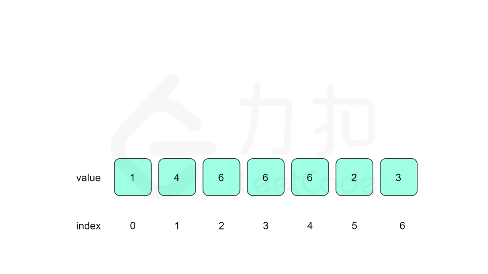

<!-- @import "[TOC]" {cmd="toc" depthFrom=1 depthTo=6 orderedList=false} -->

<!-- code_chunk_output -->

- [Coding Summary](#coding-summary)
  - [介绍](#介绍)
  - [基本代码](#基本代码)
    - [二分查找(升序数组为例)](#二分查找升序数组为例)
    - [快速排序(partition的应用，升序排列为例)](#快速排序partition的应用升序排列为例)
    - [堆排序](#堆排序)
    - [归并排序](#归并排序)
    - [字符串分割](#字符串分割)
    - [迭代遍历二叉树](#迭代遍历二叉树)
    - [strStr(KMP)](#strstrkmp)
    - [并查集](#并查集)
    - [高效位运算](#高效位运算)
  - [字符串](#字符串)
    - [比较版本号](#比较版本号)
    - [重复的子字符串](#重复的子字符串)
    - [字符串相乘](#字符串相乘)
  - [滑动窗口](#滑动窗口)
    - [无重复字符的最长子串](#无重复字符的最长子串)
    - [最小覆盖子串](#最小覆盖子串)
    - [滑动窗口最大值](#滑动窗口最大值)
  - [双指针](#双指针)
    - [基础快慢指针](#基础快慢指针)
    - [三数之和](#三数之和)
    - [字符串的排列](#字符串的排列)
    - [相交链表](#相交链表)
    - [环形链表 II](#环形链表-ii)
    - [接雨水](#接雨水)
    - [盛最多水的容器](#盛最多水的容器)
    - [寻找重复数](#寻找重复数)
    - [有效三角形的个数](#有效三角形的个数)
    - [至多包含K个不同字符的最长字串](#至多包含k个不同字符的最长字串)
  - [二路归并](#二路归并)
    - [计算数组的小和](#计算数组的小和)
  - [动态规划](#动态规划)
    - [最大子序和](#最大子序和)
    - [最长递增子序列](#最长递增子序列)
    - [接雨水](#接雨水-1)
    - [编辑距离](#编辑距离)
    - [最长有效括号](#最长有效括号)
    - [最长连续序列](#最长连续序列)
    - [买卖股票的最佳时机 II](#买卖股票的最佳时机-ii)
    - [乘积最大子数组](#乘积最大子数组)
    - [零钱兑换](#零钱兑换)
    - [零钱兑换 II](#零钱兑换-ii)
    - [买卖股票的最佳时机 III](#买卖股票的最佳时机-iii)
    - [打家劫舍 II](#打家劫舍-ii)
    - [分割回文串 II](#分割回文串-ii)
    - [正则表达式匹配](#正则表达式匹配)
    - [解码方法](#解码方法)
    - [鸡蛋掉落](#鸡蛋掉落)
    - [最长递增子序列的个数](#最长递增子序列的个数)
    - [最大子矩阵](#最大子矩阵)
    - [丑数 II](#丑数-ii)
    - [交错字符串](#交错字符串)
    - [交错字符串](#交错字符串-1)
    - [目标和](#目标和)
    - [把数字翻译成字符串](#把数字翻译成字符串)
  - [二叉树](#二叉树)
    - [二叉树的锯齿形层序遍历](#二叉树的锯齿形层序遍历)
    - [二叉树的最近公共祖先](#二叉树的最近公共祖先)
    - [二叉搜索树与双向链表](#二叉搜索树与双向链表)
    - [二叉树的完全性检验](#二叉树的完全性检验)
    - [二叉树最大宽度](#二叉树最大宽度)
    - [二叉树的序列化与反序列化](#二叉树的序列化与反序列化)
    - [另一棵树的子树](#另一棵树的子树)
    - [从前序与中序遍历序列构造二叉树](#从前序与中序遍历序列构造二叉树)
    - [从中序与后序遍历序列构造二叉树](#从中序与后序遍历序列构造二叉树)
    - [完全二叉树的节点个数](#完全二叉树的节点个数)
    - [二叉搜索树的后序遍历序列](#二叉搜索树的后序遍历序列)
  - [递归](#递归)
    - [全排列](#全排列)
    - [子集](#子集)
    - [子集II](#子集ii)
    - [路径总和 II](#路径总和-ii)
    - [路径总和 III](#路径总和-iii)
    - [复原IP地址](#复原ip地址)
    - [括号生成](#括号生成)
    - [约瑟夫环问题](#约瑟夫环问题)
    - [组合总和 II](#组合总和-ii)
    - [24点游戏](#24点游戏)
  - [二分法](#二分法)
    - [搜索旋转排序数组](#搜索旋转排序数组)
    - [最长递增子序列](#最长递增子序列-1)
    - [寻找两个正序数组的中位数](#寻找两个正序数组的中位数)
    - [寻找重复数](#寻找重复数-1)
    - [寻找旋转排序数组中的最小值 II](#寻找旋转排序数组中的最小值-ii)
    - [完全二叉树的节点个数](#完全二叉树的节点个数-1)
    - [有序矩阵中第K小的元素](#有序矩阵中第k小的元素)
    - [按权重随机选择](#按权重随机选择)
  - [单调栈](#单调栈)
    - [接雨水](#接雨水-2)
    - [移掉K位数字](#移掉k位数字)
    - [直方图最大矩形面积](#直方图最大矩形面积)
    - [最大矩形](#最大矩形)
    - [和至少为K的最短子数组](#和至少为k的最短子数组)
  - [链表](#链表)
    - [排序链表](#排序链表)
    - [重排链表](#重排链表)
    - [展平多级双向链表](#展平多级双向链表)
    - [复制带随机指针的链表](#复制带随机指针的链表)
  - [前缀和](#前缀和)
    - [路径总和 III](#路径总和-iii-1)
    - [和至少为K的最短子数组](#和至少为k的最短子数组-1)
  - [前缀树（字典树）](#前缀树字典树)
    - [键值映射](#键值映射)
    - [字典序的第K小数字](#字典序的第k小数字)
  - [集合与哈希](#集合与哈希)
    - [第一个只出现一次的字符](#第一个只出现一次的字符)
    - [最长连续序列](#最长连续序列-1)
    - [LFU 缓存](#lfu-缓存)
  - [栈和队列](#栈和队列)
    - [基本计算器](#基本计算器)
    - [基本计算器 II](#基本计算器-ii)
  - [优先级队列](#优先级队列)
    - [课程表 III](#课程表-iii)
    - [前K个高频单词](#前k个高频单词)
  - [并查集](#并查集-1)
    - [冗余连接 II](#冗余连接-ii)
    - [情侣牵手](#情侣牵手)
  - [数学](#数学)
    - [快速幂](#快速幂)
    - [快速乘](#快速乘)
    - [平方根](#平方根)
    - [用 Rand7() 实现 Rand10()](#用-rand7-实现-rand10)
    - [不同路径](#不同路径)
    - [约瑟夫环问题](#约瑟夫环问题-1)
    - [回文数](#回文数)
    - [数字1的个数](#数字1的个数)
  - [拓扑排序](#拓扑排序)
    - [课程表 II](#课程表-ii)
  - [贪心算法](#贪心算法)
    - [划分数组](#划分数组)
      - [分割数组的最大值](#分割数组的最大值)
      - [划分字母区间](#划分字母区间)
    - [数组](#数组)
      - [分发糖果](#分发糖果)
      - [加油站](#加油站)
      - [跳跃游戏 II](#跳跃游戏-ii)
    - [区间问题](#区间问题)
      - [课程表 III](#课程表-iii-1)
      - [合并区间](#合并区间)
      - [无重叠区间](#无重叠区间)
      - [视频拼接](#视频拼接)
      - [主持人调度](#主持人调度)
  - [位运算](#位运算)
    - [寻找重复数](#寻找重复数-2)
  - [其他](#其他)
    - [最长回文子串(Manacher)](#最长回文子串manacher)
    - [缺失的第一个正数(原地哈希)](#缺失的第一个正数原地哈希)
    - [字符串相乘](#字符串相乘-1)
    - [最大数](#最大数)
    - [对角线遍历](#对角线遍历)
    - [Z 字形变换](#z-字形变换)
    - [矩阵置零](#矩阵置零)
    - [旋转图像](#旋转图像)

<!-- /code_chunk_output -->

# Coding Summary

## 介绍
**个人刷OJ总结**
[主页](https://gitee.com/ymhahaha/coding-summary)


## 基本代码

### 二分查找(升序数组为例)

给出二分查找的最优写法，核心步骤和变化是**return**语句，根据需求返回$lo$，或者$lo-1$，或者$lo+1$，或者$-1$
```cpp
int BinarySearch(vector<int> &nums, int target) {
    int lo = 0, hi = nums.size() - 1;
    while (lo < hi) {
        int mi = (lo + hi) / 2;
        if (target <= nums[mi])
            hi = mi;
        else
            lo = mi + 1;
    }
    // return nums[lo] == target ? lo : -1; //不建议在此处判断
    return lo;
}
```
例题：[搜索旋转排序数组](#搜索旋转排序数组)

更进一步的写法，函数式编程！
```cpp
int binarySearch(int n, function<bool(int)> f) {
    int l = 0, r = n;
    while (l < r) {
        int mid = (l + r) / 2;
        if (f(mid))
            r = mid;
        else
            l = mid + 1;
    }
    return l;
}

{
    binarySearch(nums.size() - 1,
                 [&](int i) -> bool { return nums[i] >= target; });
}
```

### 快速排序(partition的应用，升序排列为例)
```cpp
int partition1(int *a, int begin, int end) {
    // 指定首元素为pivot，最后记得要将pivot赋值给split位置
    swap(a[begin], a[begin + rand() % (end - begin + 1)]);
    int pivot = a[begin];
    while (begin < end) {
        while (begin < end && pivot <= a[end]) --end;
        a[begin] = a[end];
        while (begin < end && pivot >= a[begin]) ++begin;
        a[end] = a[begin];
    }
    a[begin] = pivot;
    return begin;
}

int partition2(int *a, int begin, int end) {
    // 指定末元素为pivot，最后记得要与末尾交换位置
    swap(a[end], a[begin + rand() % (end - begin + 1)]);
    int pivot = a[end], pos = begin;
    for (int i = begin; i < end; ++i) {
        if (a[i] < pivot) swap(a[i], a[pos++]);
    }
    swap(a[pos], a[end]);
    return pos;
}

int partition3(int *a, int begin, int end) {
    // 指定末元素为pivot，最后记得要与末尾交换位置
    swap(a[end], a[begin + rand() % (end - begin + 1)]);
    auto it = partition(a + begin, a + end, [=](int i) { return i < a[end]; });
    int pos = it - a;
    swap(a[pos], a[end]);
    return pos;
}

void quickSort(int *a, int begin, int end) {
    // 注意end是末元素还是末元素之后的空位置即可，本例使用空位置
    if (end - begin < 2) return;
    int middle = partition1(a, begin, end - 1);
    // int middle = partition2(a, begin, end - 1);
    quickSort(a, begin, middle);
    quickSort(a, middle + 1, end);
}
```

### 堆排序

```cpp
void shiftNode(vector<int> &a, int n, int len) {
    int end = len / 2 - 1;
    while (n <= end) {
        int t = 2 * n + 2 < len && a[2 * n + 2] > a[2 * n + 1] ? 2 * n + 2
                                                               : 2 * n + 1;
        if (a[n] >= a[t]) break;
        swap(a[n], a[t]);
        n = t;
    }
}

void heapSort(vector<int> &a) {
    int len = a.size(), t = len / 2 - 1;
    while (t >= 0) {
        shiftNode(a, t, len);
        --t;
    }
    while (--len) {
        swap(a[0], a[len]);
        shiftNode(a, 0, len);
    }
}
```

### 归并排序
```cpp
vector<int> tmp;

void mergeSort(vector<int> &nums, int l, int r) {
    if (l == r) return;
    int mid = (l + r) >> 1;
    mergeSort(nums, l, mid);
    mergeSort(nums, mid + 1, r);
    // int i = l, j = mid + 1;
    // int cnt = 0;
    // while (i <= mid && j <= r)
    // {
    //     if (nums[i] <= nums[j])
    //         tmp[cnt++] = nums[i++];
    //     else
    //         tmp[cnt++] = nums[j++];
    // }
    // while (i <= mid)
    //     tmp[cnt++] = nums[i++];
    // while (j <= r)
    //     tmp[cnt++] = nums[j++];
    // for (int i = 0; i < r - l + 1; ++i)
    //     nums[i + l] = tmp[i];
    merge(nums.begin() + l, nums.begin() + mid + 1, nums.begin() + mid + 1,
          nums.begin() + r + 1, tmp.begin());
    copy(tmp.begin(), tmp.begin() + r - l + 1, nums.begin() + l);
}

vector<int> sortArray(vector<int> &nums) {
    tmp.resize((int)nums.size(), 0);
    mergeSort(nums, 0, (int)nums.size() - 1);
    return nums;
}
```

### 字符串分割
```cpp
vector<string> stringSplit(const string &s, const string &t) {
    vector<string> res;
    int l = 0, r = 0;
    while ((r = s.find(t, l)) != string::npos) {
        if (l != r) res.push_back(s.substr(l, r - l));
        l = r + t.size();
    }
    if (l != s.size()) res.push_back(s.substr(l, s.size() - l));
    return res;
}
```
另一种写法
```cpp
vector<string> stringSplit2(string &s, const string &t) {
    vector<string> res;
    s += t;
    int l = 0;
    while (l != s.size()) {
        int r = s.find(t, l);
        if (l != r) res.push_back(s.substr(l, r - l));
        l = r + t.size();
    }
    s.erase(s.end() - t.size());
    return res;
}
```

例题：[比较版本号](#比较版本号)

分割字符串（第二种写法） + lamda表达式
```cpp
int compareVersion(string version1, string version2) {
    version1 += '.';
    version2 += '.';
    int l1 = 0, r1 = 0, l2 = 0, r2 = 0, len1 = version1.size(),
        len2 = version2.size();
    while (l1 != len1 && l2 != len2) {
        r1 = version1.find('.', l1);
        r2 = version2.find('.', l2);
        int tmp1 = stoi(version1.substr(l1, r1 - l1)),
            tmp2 = stoi(version2.substr(l2, r2 - l2));
        if (tmp1 > tmp2) return 1;
        if (tmp1 < tmp2) return -1;
        l1 = r1 + 1;
        l2 = r2 + 1;
    }
    if (l1 == len1 && l2 == len2) return 0;
    if (l2 == len2)
        return find_if(version1.begin() + l1, version1.end(),
                       [](char c) { return c != '.' && c > '0'; }) ==
                       version1.end()
                   ? 0
                   : 1;
    return find_if(version2.begin() + l2, version2.end(),
                   [](char c) { return c != '.' && c > '0'; }) == version2.end()
               ? 0
               : -1;
}
```

### 迭代遍历二叉树

中序遍历
```cpp
void inOrder(TreeNode *root) {
    stack<TreeNode *> s;
    while (root || !s.empty()) {
        while (root) {
            s.push(root);
            root = root->left;
        }
        root = s.top();
        s.pop();
        visit(root);
        /*
         * do sth here
         */
        root = root->right;
    }
}
```

前序遍历
```cpp
void preOrder(TreeNode *root) {
    stack<TreeNode *> s;
    while (root || !s.empty()) {
        while (root) {
            visit(root);
            if (root->right) s.push(root->right);
            root = root->left;
        }
        if (!s.empty()) {
            root = s.top();
            s.pop();
        }
    }
}
```

节点染色实现后序遍历
```cpp
void postOrder(TreeNode *root) {
    stack<pair<int, TreeNode *>> s;
    while (root || !s.empty()) {
        while (root) {
            s.push({0, root});
            root = root->left;
        }
        if (!s.top().first) {
            s.top().first = 1;
            root = s.top().second->right;
        } else {
            s.pop();
            visit(/*pop node*/);
        }
    }
}
```

双栈实现后序遍历
```cpp
void postOrderTraversal(TreeNode* root) {
    if (!root) return;
    std::stack<TreeNode*> st1;
    std::stack<TreeNode*> st2;
    st1.push(root);
    // 栈⼀顺序存储
    while (!st1.empty()) {
        TreeNode* node = st1.top();
        st1.pop();
        st2.push(node);
        if (node->left) st1.push(node->left);
        if (node->right) st1.push(node->right);
    }
    // 栈⼆直接输出
    while (!st2.empty()) {
        visit(st2.top());
        st2.pop();
    }
    return res;
}
```

### strStr(KMP)

可以发现两部分代码十分接近。
例题：[重复的子字符串](#重复的子字符串)
```cpp
int strStr(string haystack, string needle) {
    int hl = haystack.size(), nl = needle.size();
    if (!nl) return 0;
    if (hl < nl) return -1;
    // 计算next数组
    vector<int> next(nl, 0);
    for (int i = 1, j = 0; i < nl; ++i) {
        while (j && needle[i] != needle[j]) j = next[j - 1];
        if (needle[i] == needle[j]) ++j;
        next[i] = j;
    }
    // 计算起始位置
    for (int i = 0, j = 0; i < hl; ++i) {
        while (j && haystack[i] != needle[j]) j = next[j - 1];
        if (haystack[i] == needle[j]) ++j;
        if (j == nl) return i - nl + 1;
    }
    return -1;
}
```

### 并查集

模板题：[省份数量](https://leetcode-cn.com/problems/number-of-provinces/)
```cpp
class UnionFind {
   public:
    UnionFind(args...) {
        /// TODO: Init count parent rank
    }

    int find(int i)  // 执行路径压缩
    {
        // if (parent[i] != i) {
        //     parent[i] = find(parent[i]);
        // }
        // return parent[i];
        int res = i;
        while (parent[res] != res) res = parent[res];
        int tmp = i;
        while (tmp != res) {
            int tp = parent[tmp];
            parent[tmp] = res;
            tmp = tp;
        }
        return res;
    }

    void unite(int x, int y)  // 执行按秩合并
    {
        int rootx = find(x);
        int rooty = find(y);
        if (rootx != rooty) {
            if (rank[rootx] < rank[rooty]) {
                swap(rootx, rooty);
            }
            parent[rooty] = rootx;
            if (rank[rootx] == rank[rooty]) rank[rootx] += 1;
            --count;
        }
    }

    int getCount() const { return count; }

   private:
    vector<int> parent;
    vector<int> rank;
    int count;
};
```

### 高效位运算

```cpp
int __builtin_ffs(unsigned x);      //返回x的最后一位1的是从后向前第几位，比如7368（1110011001000）返回4
int __builtin_clz(unsigned x);      //返回前导的0的个数
int __builtin_ctz(unsigned x);      //返回后面的0的个数，和__builtin_clz相对
int __builtin_popcount(unsigned x); //返回二进制表示中1的个数
int __builtin_parity(unsigned x);   //返回x的奇偶校验位，也就是x的1的个数模2的结果
```

```cpp
unsigned x;
i = x & (-x);   //x最低位1的位置
x &= x-1;       //将x最低位1置为0之后的结果
```

## 字符串

### [比较版本号](https://leetcode-cn.com/problems/compare-version-numbers/)

分割字符串即可
```cpp
int compareVersion(string version1, string version2) {
    version1 += '.';
    version2 += '.';
    int l1 = 0, r1 = 0, l2 = 0, r2 = 0, len1 = version1.size(),
        len2 = version2.size();
    while (l1 != len1 && l2 != len2) {
        r1 = version1.find('.', l1);
        r2 = version2.find('.', l2);
        int tmp1 = stoi(version1.substr(l1, r1 - l1)),
            tmp2 = stoi(version2.substr(l2, r2 - l2));
        if (tmp1 > tmp2) return 1;
        if (tmp1 < tmp2) return -1;
        l1 = r1 + 1;
        l2 = r2 + 1;
    }
    if (l1 == len1 && l2 == len2) return 0;
    if (l2 == len2)
        return find_if(version1.begin() + l1, version1.end(),
                       [](char c) { return c != '.' && c > '0'; }) ==
                       version1.end()
                   ? 0
                   : 1;
    return find_if(version2.begin() + l2, version2.end(),
                   [](char c) { return c != '.' && c > '0'; }) == version2.end()
               ? 0
               : -1;
}
```

### [重复的子字符串](https://leetcode-cn.com/problems/repeated-substring-pattern/)

结合kmp的做法，将两个s拼接，然后从拼接好的字符串的第二位开始找原始字符串，若结果不为$len$则说明是由重复的字串构成
```cpp
bool repeatedSubstringPattern(string s) {
    int len = s.size();
    vector<int> next(len, 0);
    for (int i = 1, j = 0; i < len; ++i) {
        while (j && s[i] != s[j]) j = next[j - 1];
        if (s[i] == s[j]) ++j;
        next[i] = j;
    }
    for (int i = 1, j = 0; i < len * 2; ++i) {
        while (j && s[i % len] != s[j]) j = next[j - 1];
        if (s[i % len] == s[j]) ++j;
        if (j == len) return i != 2 * len - 1;
    }
    return false;  // never reach

    /*
     *    return (s+s).find(s,1)!=s.size();
     */
}
```

### [字符串相乘](#字符串相乘-1)

## 滑动窗口

### [无重复字符的最长子串](https://leetcode-cn.com/problems/longest-substring-without-repeating-characters/)

用set保证窗口内元素的唯一性
```cpp
int lengthOfLongestSubstring(string s) {
    unordered_set<char> occ;
    int res = 0;
    for (int l = 0, r = 0; r < s.size(); ++r) {
        if (!occ.count(s[r])) {
            occ.insert(s[r]);
            res = max(res, r - l + 1);
        } else {
            while (s[l] != s[r]) {
                occ.erase(s[l]);
                ++l;
            }
            ++l;
        }
    }
    return res;
}
```

第二种方法：记录每一个字符最后出现的位置
```cpp
int lengthOfLongestSubstring(string s) {
    int last[128] = {0};  //字符数不超过128个:)
    int res = 0, cur_res = 0;
    for (int i = 0; i < s.size(); ++i) {
        cur_res = min(cur_res + 1, i + 1 - last[s[i] - 0]);
        res = max(res, cur_res);
        last[s[i] - 0] = i + 1;
    }
    return res;
}
```

### [最小覆盖子串](https://leetcode-cn.com/problems/minimum-window-substring/)

关键是使**可行窗口**滑动
```cpp
string minWindow(string s, string t) {  // 我写的代码，效率还行但是不够简洁
    int lens = s.size(), lent = t.size();
    if (!lent || lens < lent) return "";
    int nums[128] = {0};
    for (char c : t) --nums[c];
    for (char c : s) ++nums[c];
    for (int i : nums) {
        if (i < 0) {
            return "";
        }
    }
    int r = lens - 1, l = 0, res = lens, resl = 0;
    while (1) {
        --nums[s[r]];
        if (nums[s[r]] < 0) break;
        --r;
    }
    while (r < lens) {
        ++nums[s[r]];
        if (nums[s[r]] >= 0) {
            while (nums[s[l]] > 0) {
                --nums[s[l]];
                ++l;
            }
        }
        if (r - l + 1 < res) {
            resl = l;
            res = r - l + 1;
        }
        ++r;
    }
    return s.substr(resl, res);
}
```

一种更为简洁的写法，关键在于cnt的维护，使用cnt变量找到第一个可行窗口非常巧妙
```cpp
string minWindow2(string s, string t) {
    int lens = s.size(), lent = t.size();
    int hash[128] = {0};
    for (char c : t) --hash[c];
    int resl = 0, reslen = 0;
    for (int r = 0, l = 0, cnt = 0; r < lens; ++r) {
        ++hash[s[r]];
        if (hash[s[r]] <= 0) ++cnt;
        if (lent == cnt) {
            //找到可行窗口
            while (hash[s[l]] > 0) --hash[s[l++]];
            if (!reslen || reslen > r - l + 1) {
                resl = l;
                reslen = r - l + 1;
            }
        }
    }
    return s.substr(resl, reslen);
}
```

### [滑动窗口最大值](https://leetcode-cn.com/problems/sliding-window-maximum/)

滑动窗口问题一般需要维护一个数据结构，常为双端队列（单调双端队列），何时执行push，pop是关键；双端队列适用于滑动窗口先入先出的特征，并且往往需要维护一定的偏序关系
```cpp
vector<int> maxSlidingWindow(vector<int> &nums, int k) {
    int len = nums.size();
    if (!len) return {};
    vector<int> res;
    deque<int> s;
    int i = 0;
    while (i < k) {
        while (!s.empty() && s.back() < nums[i]) s.pop_back();
        s.push_back(nums[i]);
        ++i;
    }
    res.push_back(s.front());
    while (i < len) {
        if (nums[i - k] == s.front()) s.pop_front();
        while (!s.empty() && s.back() < nums[i]) s.pop_back();
        s.push_back(nums[i]);
        res.push_back(s.front());
        ++i;
    }
    return res;
}
```

## 双指针

### 基础快慢指针

使慢指针正好指向数组后半段的开始(长度为奇则指向中点之后的节点，长度为偶则指向后半段第一个节点)
```cpp
void doublePointer(ListNode *head) {
    ListNode *fast = head, *slow = head;
    while (fast) {
        slow = slow->next;
        fast = fast->next;
        if (!fast) break;
        fast = fast->next;
        // TODO:
        // 可以在这里加入反转链表等操作，相当于反转链表前半部分（不包括奇数队列中点）
    }
}
```
使慢指针正好指向数组前半段的结束(长度为奇则指向中点，长度为偶则指向前半段最后一个节点)
```cpp
void doublePointer2(ListNode *head) {
    ListNode *fast = head, *slow = head;
    while (fast) {
        fast = fast->next;
        if (!fast) break;
        fast = fast->next;
        if (!fast) break;
        slow = slow->next;
        // TODO:
        // 可以在这里加入反转链表等操作，相当于反转链表后半部分（不包括奇数队列中点）
    }
}
```

### [三数之和](https://leetcode-cn.com/problems/3sum/)

经典的有序数组上使用双指针
```cpp
vector<vector<int>> threeSum(vector<int> &nums) {
    if (3 > nums.size()) return {};
    int len = nums.size();
    sort(nums.begin(), nums.end());
    vector<vector<int>> res;
    for (int i = 0; i < len - 2;) {
        int lo = i + 1, hi = len - 1, sum = -nums[i];
        while (lo < hi) {
            if (nums[lo] + nums[hi] == sum) {
                res.push_back({nums[i], nums[lo++], nums[hi--]});
                while (lo < hi && nums[lo] == nums[lo - 1]) ++lo;
                while (lo < hi && nums[hi] == nums[hi + 1]) --hi;
            } else if (nums[lo] + nums[hi] < sum) {
                ++lo;
                while (lo < hi && nums[lo] == nums[lo - 1]) ++lo;
            } else {
                --hi;
                while (lo < hi && nums[hi] == nums[hi + 1]) --hi;
            }
        }
        ++i;
        while (i < len - 2 && nums[i] == nums[i - 1]) ++i;
    }
    return res;
}
```

### [字符串的排列](https://leetcode-cn.com/problems/permutation-in-string/)

在出现某一字母出现次数多于s1中该字母出现次数时更新左指针，以及精妙设计循环终结条件。
终结条件：
- 左右指针之间的长度等于s1长度（即所有字母出现的次数恰好正确）
- 没有任何一个多余的字母（结合条件1等价于各个字母出现次数恰好正确，确定为结果）
```cpp
bool checkInclusion(string s1, string s2) {
    int len1 = s1.size(), len2 = s2.size();
    if (len1 > len2) return false;
    int charnum[26] = {0};
    for (auto &c : s1) ++charnum[c - 'a'];
    int left = 0, right = 0;
    while (right < len2) {
        --charnum[s2[right] - 'a'];
        while (charnum[s2[right] - 'a'] < 0) {
            ++charnum[s2[left++] - 'a'];
        }
        if (right - left + 1 == len1) return true;
        ++right;
    }
    return false;
}
```

### [相交链表](https://leetcode-cn.com/problems/intersection-of-two-linked-lists/)

典型的在两个链表中使用双指针，某一指针遍历当前链表结束后，接到另一链表的头节点，可以保证两个指针一定会相遇（nullptr或某一相交节点）
```cpp
ListNode *getIntersectionNode(ListNode *headA, ListNode *headB) {
    if (!headA || !headB) return NULL;
    ListNode *pa = headA, *pb = headB;
    while (pa != pb) {
        pa = pa ? pa->next : headB;
        pb = pb ? pb->next : headA;
    }
    return pa;
}
```

### [环形链表 II](https://leetcode-cn.com/problems/linked-list-cycle-ii/)

仔细探索双指针移动距离的数学关系，快指针是慢指针移动距离的两倍，并且正好多走一个环的距离，因此在指针相遇后让另一指针(这里直接复用了不再使用的快指针变量)从头开始遍历，该指针和慢指针会正好在环形入口相遇
```cpp
ListNode *detectCycle(ListNode *head) {
    ListNode *s = head, *f = head;
    while (s && f) {
        s = s->next;
        f = f->next;
        if (!f) return NULL;
        f = f->next;
        if (s == f) break;
    }
    if (!f) return NULL;
    f = head;
    while (s != f) {
        s = s->next;
        f = f->next;
    }
    return s;
}
```

### [接雨水](https://leetcode-cn.com/problems/trapping-rain-water/)
从数组两端向中间靠近的双指针，$height[l]==lmax$或者$height[r]==rmax$不可能同时为假
```cpp
int trap(vector<int> &height) {
    if (height.size() < 3) return 0;
    int l = 0, r = height.size() - 1, lmax = height[l], rmax = height[r],
        res = 0;
    while (l < r) {
        if (height[l] <= rmax) {
            ++l;
            height[l] > lmax ? lmax = height[l] : res += lmax - height[l];
        } else {
            --r;
            height[r] > rmax ? rmax = height[r] : res += rmax - height[r];
        }
    }
    return res;
}
```

### [盛最多水的容器](https://leetcode-cn.com/problems/container-with-most-water/)


和接雨水简直一模一样
```cpp
int maxArea(vector<int> &height) {
    int res = 0, left = 0, right = height.size() - 1;
    while (left < right) {
        res = max(res, min(height[left], height[right]) * (right - left));
        height[left] <= height[right] ? ++left : --right;
    }
    return res;
}
```

### [寻找重复数](https://leetcode-cn.com/problems/find-the-duplicate-number/)

**快慢双指针**，非常高明的思路，将问题化为[环形链表 II（Floyd 判圈算法）](#环形链表-ii)，$O(n)$

- 在nums数组上建图，每个位置$i$建立一条$i\to nums[i]$的边
- 由于存在的重复的数字$target$，因此$target$这个位置一定有起码两条指向它的边，因此整张图一定存在环，且我们要找到的$target$就是这个环的入口
- 问题转化为[环形链表 II（Floyd 判圈算法）](#环形链表-ii)

```cpp
int findDuplicate(vector<int> &nums) {
    int fast = 0, slow = 0;
    do {
        slow = nums[slow];
        fast = nums[nums[fast]];
    } while (fast != slow);
    slow = 0;
    while (fast != slow) {
        slow = nums[slow];
        fast = nums[fast];
    }
    return slow;
}
```

**位运算思路**
重复的数字一定会导致该数字二进制表示的每一位在所有数字里面变多，$O(nlogn)$
```cpp
int findDuplicate(vector<int> &nums) {
    int bit = 31, n = nums.size(), res = 0;
    while (!((n - 1) >> bit)) --bit;
    for (int i = 0; i <= bit; ++i) {
        int t1 = 0, t2 = 0;
        for (int j = 0; j < n; ++j) {
            t1 += (nums[j] >> i) & 1;
            t2 += (j >> i) & 1;
        }
        if (t1 > t2) res |= 1 << i;
    }
    return res;
}
```

**二分思路**
直接在数据的值域上二分，不要想到二分就对数组进行partition，$O(nlogn)$
```cpp
int findDuplicate(vector<int> &nums) {
    int n = nums.size(), l = 1, r = n - 1;
    while (l < r) {
        int mid = (l + r) >> 1, cnt = 0;
        for (int i = 0; i < n; ++i) cnt += nums[i] <= mid;
        if (cnt <= mid)
            l = mid + 1;
        else
            r = mid;
    }
    return l;
}
```

### [有效三角形的个数](https://leetcode-cn.com/problems/valid-triangle-number/)

嵌套在for循环中的双指针，时间复杂度$O(n^2)$
```cpp
int triangleNumber(vector<int> &nums) {
    int n = nums.size(), res = 0;
    if (n < 3) return 0;
    sort(nums.begin(), nums.end());
    for (int i = 0; i < n - 2; ++i) {
        if (!nums[i]) continue;
        for (int l = i + 1, r = i + 2; r < n; ++r) {
            while (l < r && nums[i] + nums[l] <= nums[r]) ++l;
            res += r - l;
        }
    }
    return res;
}
```

### [至多包含K个不同字符的最长字串](https://leetcode-cn.com/problems/longest-substring-with-at-most-k-distinct-characters/)

非常基础的双指针
```cpp
int lengthOfLongestSubstringKDistinct(string s, int k) {
    if (!k) return 0;
    int res = 0;
    vector<int> charNum(128, 0);
    for (int l = 0, r = 0, cnum = 0, len = s.size(); r < len; ++r) {
        if (!(charNum[s[r]]++)) ++cnum;
        while (cnum > k) {
            if (!(--charNum[s[l++]])) --cnum;
        }
        res = max(res, r - l + 1);
    }
    return res;
}
```

## 二路归并

### [计算数组的小和](https://mp.weixin.qq.com/s/rMsbcUf9ZPhvfRoyZGW6HA)

求“正序对”，其实还是归并思想

```cpp
class Solution {
   private:
    int mergeSum(vector<int> &nums, vector<int> &tmp, int l, int r) {
        if (l == r) return 0;
        int m = l + ((r - l) >> 1);
        int res = mergeSum(nums, tmp, l, m) + mergeSum(nums, tmp, m + 1, r);
        int p1 = l, p2 = m + 1, p3 = l;
        while (p3 != r + 1) {
            if (p2 == r + 1 || p1 != m + 1 && nums[p1] < nums[p2]) {
                tmp[p3++] = nums[p1++];
                res += (r - p2 + 1) * nums[p1 - 1];
            } else
                tmp[p3++] = nums[p2++];
        }
        copy(tmp.begin() + l, tmp.begin() + r + 1, nums.begin() + l);
        return res;
    }

   public:
    int smallSum(vector<int> &nums) {
        int len = nums.size();
        if (len < 2) return 0;
        vector<int> tmp(len);
        return mergeSum(nums, tmp, 0, len - 1);
    }
};
```

## 动态规划

### [最大子序和](https://leetcode-cn.com/problems/maximum-subarray/)

经典的当前状态可以仅从上一状态推导，推导方程$$cur[i]=max(nums[i],nums[i]+cur[i-1])$$
```cpp
int maxSubArray(vector<int>& nums) {
    int cur=-100001,res=-100001;
    for(int &i:nums) {
        // if(0>cur)cur=i;
        // else cur+=i;
        cur=max(i,cur+i);
        res=max(res,cur);
    }
    return res;
}
```

### [最长递增子序列](https://leetcode-cn.com/problems/longest-increasing-subsequence/)

动态规划的目标非常巧妙，目标是长度为i的严格递增子序列的末尾数字的最小值，该动态规划数组必然严格递增，此时可以使用二分法查找对应位置
```cpp
int search(vector<int> &nums, int len, int target) {
    int l = 0, h = len - 1;
    while (l < h) {
        int m = (l + h) / 2;
        if (target <= nums[m])
            h = m;
        else
            l = m + 1;
    }
    return target > nums[l] ? l : l - 1;
}
int lengthOfLIS(vector<int> &nums) {
    int len = nums.size(), maxlen = 1;
    vector<int> mintail(len);
    mintail[0] = nums[0];
    for (int i = 1; i < len; ++i) {
        if (nums[i] > mintail[maxlen - 1]) {
            mintail[maxlen++] = nums[i];
            continue;
        }
        int index = search(mintail, maxlen, nums[i]);
        mintail[index + 1] = nums[i];
    }
    return maxlen;
}
```

可以直接调用$lower\_bound()$
```cpp
int lengthOfLIS(vector<int> &nums) {
    int len = nums.size(), maxlen = 1;
    vector<int> mintail(len);
    mintail[0] = nums[0];
    for (int i = 1; i < len; ++i) {
        if (nums[i] > mintail[maxlen - 1]) {
            mintail[maxlen++] = nums[i];
            continue;
        }
        auto it =
            lower_bound(mintail.begin(), mintail.begin() + maxlen, nums[i]);
        *it = nums[i];
    }
    return maxlen;
}
```

### [接雨水](#接雨水)

### [编辑距离](https://leetcode-cn.com/problems/edit-distance/)

主要就是把动态规划递推公式想清楚，$dp[i][j]$代表$word1$前$i$个字符和$word2$前$j$个字符之间的编辑距离，因此可以初始化$dp[0][k]$和$dp[k][0]$
```cpp
int minDistance(string word1, string word2) {
    int len1 = word1.size(), len2 = word2.size();
    if (0 == len1 * len2) return len1 + len2;
    vector<vector<int>> dp(len1 + 1, vector<int>(len2 + 1));
    for (int i = 0; i <= len1; ++i) dp[i][0] = i;
    for (int i = 0; i <= len2; ++i) dp[0][i] = i;
    for (int i = 1; i <= len1; ++i) {
        for (int j = 1; j <= len2; ++j) {
            int tmp = min(dp[i][j - 1], dp[i - 1][j]) + 1,
                tmp2 = dp[i - 1][j - 1] + (word1[i - 1] != word2[j - 1]);
            dp[i][j] = min(tmp, tmp2);
        }
    }
    return dp[len1][len2];
}
```

### [最长有效括号](https://leetcode-cn.com/problems/longest-valid-parentheses/)

dp数组表示以i结尾的最长有效括号长度
```cpp
int longestValidParentheses(string s) {
    if (s.size() < 2) return 0;
    int res = 0;
    vector<int> dp(s.size(), 0);
    for (int i = 1; i < s.size(); ++i) {
        if (s[i] == ')' && i - 1 - dp[i - 1] >= 0 &&
            s[i - 1 - dp[i - 1]] == '(') {
            dp[i] = dp[i - 1] + 2;
            if (i - dp[i - 1] > 1) dp[i] += dp[i - dp[i - 1] - 2];
            res = max(res, dp[i]);
        }
    }
    return res;
}
```

无需额外空间的做法，先正向遍历，再反向遍历
```cpp
int longestValidParentheses(String s) {
    int left = 0, right = 0, maxlength = 0;
    for (int i = 0; i < s.length(); i++) {
        if (s.charAt(i) == '(') {
            left++;
        } else {
            right++;
        }
        if (left == right) {
            maxlength = Math.max(maxlength, 2 * right);
        } else if (right > left) {
            left = right = 0;
        }
    }
    left = right = 0;
    for (int i = s.length() - 1; i >= 0; i--) {
        if (s.charAt(i) == '(') {
            left++;
        } else {
            right++;
        }
        if (left == right) {
            maxlength = Math.max(maxlength, 2 * left);
        } else if (left > right) {
            left = right = 0;
        }
    }
    return maxlength;
}
```

### [最长连续序列](#最长连续序列)
dp算法见解法2

### [买卖股票的最佳时机 II](https://leetcode-cn.com/problems/best-time-to-buy-and-sell-stock-ii/)

贪心算法固然极好，动态规划算法的思路也需要掌握
```cpp
int maxProfit(vector<int> &prices) {
    // 贪心
    int res = 0;
    for (int i = 1; i < prices.size(); ++i) {
        res += max(0, prices[i] - prices[i - 1]);
    }
    return res;
}

int maxProfit(vector<int> &prices) {
    // dp
    int n = prices.size();
    // dp0代表当天手中没有股票的收益，dp1代表当天手中有股票的最大收益
    int dp0 = 0, dp1 = -prices[0];
    for (int i = 1; i < n; ++i) {
        int newDp0 = max(dp0, dp1 + prices[i]);
        int newDp1 = max(dp1, dp0 - prices[i]);
        dp0 = newDp0;
        dp1 = newDp1;
    }
    return dp0;
}
```

### [乘积最大子数组](https://leetcode-cn.com/problems/maximum-product-subarray/)

这两题都体现了使用两个动态规划目标解决问题的思想
```cpp
int maxProduct(vector<int> &nums) {
    int dp0 = nums[0] > 0 ? nums[0] : 0, dp1 = nums[0] < 0 ? nums[0] : 0;
    // dp0代表当前位置结束的 绝对值最大且为正的连续乘积；
    // dp1代表当前位置结束的 绝对值最大且为负的连续乘积；
    // 不存在则取0
    int res = nums[0];
    for (int i = 1; i < nums.size(); ++i) {
        int t0 = dp0, t1 = dp1;
        if (nums[i] >= 0) {
            dp0 = max(nums[i], nums[i] * t0);
            dp1 = nums[i] * t1;
        } else if (nums[i] < 0) {
            dp0 = nums[i] * t1;
            dp1 = min(nums[i], nums[i] * t0);
        }
        res = max(res, dp0);
    }
    return res;
}
```

让步骤更加简洁的做法
```cpp
int maxProduct(vector<int> &nums) {
    int dp0 = nums[0], dp1 = nums[0], res = nums[0];
    // dp0表示连乘的最大值，dp1表示连乘的最小值，代码清爽多了
    for (int i = 1; i < nums.size(); ++i) {
        int t0 = dp0, t1 = dp1;
        dp0 = max(max(nums[i], nums[i] * t0), nums[i] * t1);
        dp1 = min(min(nums[i], nums[i] * t0), nums[i] * t1);
        res = max(res, dp0);
    }
    return res;
}
```

### [零钱兑换](https://leetcode-cn.com/problems/coin-change/)

最基础的dp
```cpp
int coinChange(vector<int> &coins, int amount) {
    vector<int> dp(amount + 1, amount + 1);
    dp[0] = 0;
    for (int i = 1; i <= amount; ++i) {
        for (const int &j : coins) {
            if (j <= i) dp[i] = min(dp[i], 1 + dp[i - j]);
        }
    }
    // for (int i : coins)
    // {
    //     for (int j = 1; j <= amount; ++j)
    //     {
    //         if (j >= i)
    //             dp[j] = min(dp[j], 1 + dp[j - i]);
    //     }
    // } //两种写法均可
    return dp[amount] > amount ? -1 : dp[amount];
}
```

### [零钱兑换 II](https://leetcode-cn.com/problems/coin-change-2/)

有所不同，改变了dp中for循环的嵌套顺序，仔细体会9，10两题的差别
```cpp
int change(int amount, vector<int> &coins) {
    vector<int> dp(amount + 1, 0);
    dp[0] = 1;
    for (int i : coins) {
        for (int j = 1; j <= amount; ++j) {
            if (j >= i) dp[j] += dp[j - i];
        }
    }
    return dp[amount];
}
```

### [买卖股票的最佳时机 III](https://leetcode-cn.com/problems/best-time-to-buy-and-sell-stock-iii/)

将每天动态规划目标分为四个状态：买一支后，卖出一支后，买第二支后，卖出第二支后
```cpp
int maxProfit(vector<int> &prices) {
    if (prices.size() == 1) return 0;
    int status[4] = {INT_MIN, INT_MIN, INT_MIN, INT_MIN};
    status[0] = -prices[0];
    for (int i = 1; i < prices.size(); ++i) {
        if (i > 2) status[3] = max(status[3], status[2] + prices[i]);
        if (i > 1) status[2] = max(status[2], status[1] - prices[i]);
        status[1] = max(status[1], status[0] + prices[i]);
        status[0] = max(status[0], -prices[i]);
    }
    return max(0, max(status[1], status[3]));
}
```

### [打家劫舍 II](https://leetcode-cn.com/problems/house-robber-ii/)

注重这种思想，使用多个动态规划目标计算目标。
本题中根据两种情况分别设定dp目标：偷盗第一个房屋的收益、不偷盗第一个房屋的收益。
```cpp
int rob(vector<int> &nums) {
    int len = nums.size();
    if (len == 1) return nums[0];
    if (len == 2) return max(nums[0], nums[1]);
    int w1 = nums[0], w2 = max(nums[0], nums[1]),  //偷第一间房屋的收益
        wo1 = 0, wo2 = nums[1];  //不偷第一间房屋的收益
    for (int i = 2; i < len - 1; ++i) {
        int t = max(w2, w1 + nums[i]);
        w1 = w2;
        w2 = t;
        t = max(wo2, wo1 + nums[i]);
        wo1 = wo2;
        wo2 = t;
    }
    wo2 = max(wo2, wo1 + nums[len - 1]);  //不偷第一间房屋则可以偷最后一间房屋
    return max(w2, wo2);  //最高收益：两种情况的更大值
}
```

### [分割回文串 II](https://leetcode-cn.com/problems/palindrome-partitioning-ii/)

最正常的dp，重点在于内层循环的设计以及dp矩阵的更新方式
```cpp
int minCut(string s) {
    int len = s.size();
    if (len < 2) return 0;
    vector<int> dp(len, len);
    for (int i = 0; i < len; ++i) {
        int l = i, r = i;
        while (l > -1 && r < len) {
            if (s[l] != s[r]) break;
            dp[r] = l == 0 ? 0 : min(dp[r], dp[l - 1] + 1);
            --l;
            ++r;
        }
        l = i;
        r = i + 1;
        while (l > -1 && r < len) {
            if (s[l] != s[r]) break;
            dp[r] = l == 0 ? 0 : min(dp[r], dp[l - 1] + 1);
            --l;
            ++r;
        }
    }
    return dp[len - 1];
}
```

### [正则表达式匹配](https://leetcode-cn.com/problems/regular-expression-matching/)

重点在于$\ \ * $的处理
```cpp
bool isMatch(string s, string p) {
    int m = s.size(), n = p.size();

    auto charMatch = [&](int i, int j) -> bool {
        if (!i) return !j;
        return p[j - 1] == '.' ? true : s[i - 1] == p[j - 1];
    };

    vector<vector<int>> dp(m + 1, vector<int>(n + 1, 0));
    dp[0][0] = 1;

    for (int i = 0; i <= m; ++i) {
        for (int j = 1; j <= n; ++j) {
            if (p[j - 1] == '*') {
                dp[i][j] |= dp[i][j - 2];
                if (charMatch(i, j - 1)) dp[i][j] |= dp[i - 1][j];
            } else if (charMatch(i, j))
                dp[i][j] |= dp[i - 1][j - 1];
        }
    }
    return dp[m][n];
}
```

### [解码方法](https://leetcode-cn.com/problems/decode-ways/)

就是正常的dp，题材新一点而已
```cpp
int numDecodings(string s) {
    int n = s.size();
    int a = 0, b = 1, c = 0;
    for (int i = 0; i < n; ++i) {
        c = 0;
        if (s[i] != '0') c += b;
        if (i && s[i - 1] != '0' && (s[i - 1] - '0') * 10 + (s[i] - '0') <= 26)
            c += a;
        a = b;
        b = c;
    }
    return c;
}
```

### [鸡蛋掉落](https://leetcode-cn.com/problems/super-egg-drop/)

经典题目，重要的是dp思想：状态可以表示成$(k, n)$，其中$k$为鸡蛋数，$n$为楼层数。当我们从第$x$楼扔鸡蛋的时候：
- 如果鸡蛋不碎，那么状态变成$(k, n-x)$，即我们鸡蛋的数目不变，但答案只可能在上方的$n-x$层楼了。也就是说，我们把原问题缩小成了一个规模为$(k, n-x)$的子问题；
- 如果鸡蛋碎了，那么状态变成$(k-1, x-1)$，即我们少了一个鸡蛋，但我们知道答案只可能在第$x$楼下方的$x-1$层楼中了。也就是说，我们把原问题缩小成了一个规模为$(k-1, x-1)$的子问题。

$$dp(k,n)=1+min_{1\le x\le n}(max(dp(k-1,x-1),dp(k,n-x)))$$

最直观的的方法，直接dp，时间复杂度$O(KN^2)$
```cpp
int superEggDrop3(int K, int N) {
    vector<vector<int>> dp(K, vector<int>(N + 1));
    for (int i = 0; i < K; ++i) dp[i][0] = 0;

    for (int j = 0; j < N + 1; ++j) dp[0][j] = j;

    for (int i = 1; i < K; ++i) {
        for (int j = 1; j < N + 1; ++j) {
            int tmp = INT_MAX;
            for (int k = 1; k <= j; ++k) {
                tmp = min(tmp, max(dp[i][j - k], dp[i - 1][k - 1]));
            }
            dp[i][j] = 1 + tmp;
        }
    }
    return dp[K - 1][N];
}
```

观察到$dp[i][j - k], dp[i - 1][k - 1]$都随$k$变化单调变动(前者递减，后者递增)，可以使用二分法找到上文中的$x$，找到$dp[i - 1][k - 1]-dp[i][j - k]$的零点即可。时间复杂度$O(KNlogN)$
```cpp
int superEggDrop2(int K, int N) {
    vector<vector<int>> dp(K, vector<int>(N + 1));
    for (int i = 0; i < K; ++i) dp[i][0] = 0;

    for (int j = 0; j < N + 1; ++j) dp[0][j] = j;

    for (int i = 1; i < K; ++i) {
        for (int j = 1; j < N + 1; ++j) {
            int l = 1, r = j;
            while (l < r) {
                int m = l + ((r - l) >> 1);
                if (dp[i - 1][m - 1] <= dp[i][j - m])
                    l = m + 1;
                else
                    r = m;
            }
            dp[i][j] = 1 + min(dp[i - 1][l - 1], dp[i][j - l + 1]);
        }
    }
    return dp[K - 1][N];
}
```

进一步优化的做法：反过来想这个问题：如果我们可以做$t$次操作，而且有$k$个鸡蛋，那么我们能找到答案的最高的$n$是多少？我们设$f(t, k)$为在上述条件下的$n$。如果我们求出了所有的$f(t, k)$，那么只需要找出最小的满足$f(t, k) \geq n$的$t$。
$$f(t,k)=1+f(t−1,k−1)+f(t−1,k)$$
那么问题来了：$t$最大可以达到多少？由于我们在进行动态规划时，$t$在题目中并没有给出，那么我们需要进行到动态规划的哪一步呢？可以发现，操作次数是一定不会超过楼层数的，因此$t \leq n$，我们只要算出在$f(n, k)$内的所有$f$值即可。
```cpp
int superEggDrop(int K, int N) {
    vector<vector<int>> dp(N, vector<int>(K, 1));
    for (int i = 1; i < N; ++i) {
        dp[i][0] = i + 1;
        for (int j = 1; j < K; ++j)
            dp[i][j] = 1 + dp[i - 1][j] + dp[i - 1][j - 1];

        if (dp[i][K - 1] >= N) return i + 1;
    }
    return 1;
}
```

### [最长递增子序列的个数](https://leetcode-cn.com/problems/number-of-longest-increasing-subsequence/)

与[最长递增子序列](#最长递增子序列)思路接近
```cpp
class Solution {
   private:
    int binarySearch(int n, function<bool(int)> f) {
        int l = 0, r = n;
        while (l < r) {
            int mid = (l + r) / 2;
            if (f(mid))
                r = mid;
            else
                l = mid + 1;
        }
        return l;
    }

   public:
    int findNumberOfLIS(vector<int> &nums) {
        vector<vector<int>> d, cnt;
        for (int v : nums) {
            int i =
                binarySearch(d.size(), [&](int i) { return d[i].back() >= v; });
            int c = 1;
            if (i > 0) {
                int k = binarySearch(d[i - 1].size(),
                                     [&](int k) { return d[i - 1][k] < v; });
                c = cnt[i - 1].back() - cnt[i - 1][k];
            }
            if (i == d.size()) {
                d.push_back({v});
                cnt.push_back({0, c});
            } else {
                d[i].push_back(v);
                cnt[i].push_back(cnt[i].back() + c);
            }
        }
        return cnt.back().back();
    }
};
```

调用stl算法函数
```cpp
int findNumberOfLIS(vector<int> &nums) {
    vector<vector<int>> d, cnt;
    for (int v : nums) {
        int i =
            lower_bound(d.begin(), d.end(), v,
                        [&](vector<int> &i, int j) { return i.back() < j; }) -
            d.begin();
        int c = 1;
        if (i > 0) {
            int k = upper_bound(d[i - 1].begin(), d[i - 1].end(), v,
                                [](int i, int j) { return i > j; }) -
                    d[i - 1].begin();
            c = cnt[i - 1].back() - cnt[i - 1][k];
        }
        if (i == d.size()) {
            d.push_back({v});
            cnt.push_back({0, c});
        } else {
            d[i].push_back(v);
            cnt[i].push_back(cnt[i].back() + c);
        }
    }
    return cnt.back().back();
}
```

### [最大子矩阵](https://leetcode-cn.com/problems/max-submatrix-lcci/)

与[最大子序和](#最大子序和)思路相同，重点在于如何用最简洁的方法遍历所有子矩阵

```cpp
vector<int> getMaxMatrix(vector<vector<int>> &matrix) {
    int m = matrix.size(), n = matrix[0].size(), maxSum = INT_MIN;
    vector<int> dp(n), res(4);
    for (int i = 0; i < m; ++i) {
        dp.assign(n, 0);
        for (int j = i; j < m; ++j) {
            int sum = INT_MIN, l = 0;
            for (int r = 0; r < n; ++r) {
                dp[r] +=
                    matrix[j][r];  // dp[r]代表matrix[i][r]到matrix[j][r]之和
                if (sum <= 0) {
                    sum = dp[r];
                    l = r;
                } else {
                    sum += dp[r];
                }
                //上述if-else类似一维数组最大子序和的动规过程
                if (sum > maxSum) {
                    maxSum = sum;
                    res = {i, l, j, r};
                }
            }
        }
    }
    return res;
}
```

### [丑数 II](https://leetcode-cn.com/problems/ugly-number-ii/)

又是一道有趣的动态规划
```cpp
int nthUglyNumber(int n) {
    vector<int> dp(n + 1);
    dp[1] = 1;
    int i = 1, j = 1, k = 1;
    for (int m = 2; m <= n; ++m) {
        dp[m] = min(dp[i] * 2, min(dp[j] * 3, dp[k] * 5));
        i += dp[m] == dp[i] * 2;
        j += dp[m] == dp[j] * 3;
        k += dp[m] == dp[k] * 5;
    }
    return dp[n];
}
```

### [交错字符串](https://leetcode-cn.com/problems/interleaving-string/)

基础动规问题


```cpp
bool isInterleave(string s1, string s2, string s3) {
    int len1 = s1.size(), len2 = s2.size(), len3 = s3.size();
    if (len1 + len2 != len3) return false;
    vector<bool> dp(len2 + 1, false);
    dp[0] = true;
    for (int j = 1; j <= len2; ++j) {
        if (s2[j - 1] != s3[j - 1]) break;
        dp[j] = true;
    }
    for (int i = 1; i <= len1; ++i) {
        dp[0] = dp[0] && s1[i - 1] == s3[i - 1];
        for (int j = 1; j <= len2; ++j) {
            dp[j] = dp[j - 1] && s2[j - 1] == s3[i + j - 1] ||
                    dp[j] && s1[i - 1] == s3[i + j - 1];
        }
    }
    return dp[len2];
}
```

### [交错字符串](https://leetcode-cn.com/problems/interleaving-string/)

多总结字符串的dp问题

```cpp
bool isMatch(string s, string p) {
    int lens = s.size(), lenp = p.size();
    vector<vector<bool>> dp(lenp + 1, vector<bool>(lens + 1, false));
    dp[0][0] = true;
    for (int i = 1; i <= lenp && p[i - 1] == '*'; ++i) dp[i][0] = true;
    for (int i = 1; i <= lenp; ++i) {
        bool matched = dp[i][0];
        for (int j = 1; j <= lens; ++j) {
            if (p[i - 1] == '*') {
                int tmp = find(dp[i - 1].begin(), dp[i - 1].end(), true) -
                          dp[i - 1].begin();
                while (tmp <= lens) {
                    matched = true;
                    dp[i][tmp] = true;
                    ++tmp;
                }
                break;
            } else if (p[i - 1] == '?') {
                dp[i][j] = dp[i - 1][j - 1];
                matched = matched || dp[i][j];
            } else {
                dp[i][j] = p[i - 1] == s[j - 1] && dp[i - 1][j - 1];
                matched = matched || dp[i][j];
            }
        }
        if (!matched) return false;
    }
    return dp[lenp][lens];
}
```

### [目标和](https://leetcode-cn.com/problems/target-sum/)

所有数字为非负整数，设加号后的数字之和为$pos$，减号后的数字之和为$neg$，则$pos+neg=sum$

则运算结果为$pos-neg=sum-2*neg=target,neg=\frac{sum-target}{2}$

转化为dp问题，在数组中选择若干数字，和为$neg$，（neg小于零或为奇数则直接返回0）

即同时使用多个目标解决问题的动态规划

```cpp
int findTargetSumWays(vector<int> &nums, int target) {
    int sum = 0;
    for (int &i : nums) sum += i;
    int diff = sum - target;
    if (diff < 0 || diff & 1) return 0;
    diff >>= 1;
    vector<int> dp(diff + 1, 0);
    dp[0] = 1;
    for (int &i : nums) {
        for (int k = diff; k >= i; --k) dp[k] += dp[k - i];
    }
    return dp[diff];
}
```

### [把数字翻译成字符串](https://leetcode-cn.com/problems/ba-shu-zi-fan-yi-cheng-zi-fu-chuan-lcof/)

依据是否可以使用上一位的数字做动规，变为了类似打家劫舍的问题

```cpp
int translateNum(int num) {
    long num2 = num, i = 10;
    int a = 1, b = 1, mask, tmp;
    while (num2 / i) {
        mask = (num2 % (10 * i)) / (i / 10), tmp = b;
        b = mask > 9 && mask < 26 ? b + a : b;
        a = tmp;
        i *= 10;
    }
    return b;
}
```

## 二叉树

### [二叉树的锯齿形层序遍历](https://leetcode-cn.com/problems/binary-tree-zigzag-level-order-traversal/)

简单的层次遍历二叉树，视情况确定使用vector或者deque存储每一层队列中pop出的节点，不过必须使用队列存放入队节点

```cpp
vector<vector<int>> zigzagLevelOrder(TreeNode *root) {
    if (!root) return {};
    vector<vector<int>> res;
    queue<TreeNode *> q;
    q.push(root);
    int order = 1;
    while (!q.empty()) {
        deque<int> dq;
        int num = q.size();
        while (num--) {
            TreeNode *t = q.front();
            q.pop();
            if (order)
                dq.push_back(t->val);
            else
                dq.push_front(t->val);
            if (t->left) q.push(t->left);
            if (t->right) q.push(t->right);
        }
        res.emplace_back(dq.begin(), dq.end());
        order ^= 1;
    }
    return res;
}
```

### [二叉树的最近公共祖先](https://leetcode-cn.com/problems/lowest-common-ancestor-of-a-binary-tree/)

在类中设置类成员变量，在遍历树时改变成员变量状态（个人不习惯的做法，但是好用）
```cpp
class Solution {
   private:
    int status;  //表示已经找到了几个目标节点
    TreeNode *res, *tp, *tq;
    void help(TreeNode *root) {
        if (!root) return;
        int origin_status = status;
        help(root->left);
        if (status == 2) return;
        help(root->right);
        if (root == tp || root == tq) ++status;
        if (!res && origin_status == 0 && status == 2)  //公共父节点的判断条件
            res = root;
        return;
    }

   public:
    TreeNode *lowestCommonAncestor(TreeNode *root, TreeNode *p, TreeNode *q) {
        status = 0;
        tp = p;
        tq = q;
        res = NULL;
        help(root);
        return res;
    }
};
```

还有一种使用更少成员变量的写法
```cpp
class Solution {
   public:
    TreeNode *ans;
    bool dfs(TreeNode *root, TreeNode *p, TreeNode *q) {
        if (root == nullptr) return false;
        bool lson = dfs(root->left, p, q);
        if (ans) return true;
        bool rson = dfs(root->right, p, q);
        if ((lson && rson) ||
            ((root->val == p->val || root->val == q->val) && (lson || rson))) {
            ans = root;
        }
        return lson || rson || (root->val == p->val || root->val == q->val);
    }
    TreeNode *lowestCommonAncestor(TreeNode *root, TreeNode *p, TreeNode *q) {
        dfs(root, p, q);
        return ans;
    }
};
```

### [二叉搜索树与双向链表](https://leetcode-cn.com/problems/er-cha-sou-suo-shu-yu-shuang-xiang-lian-biao-lcof/)

线索化二叉树，迭代中序遍历
```cpp
Node *treeToDoublyList(Node *root) {
    if (!root) return nullptr;
    Node *head = nullptr, *prev = nullptr;
    stack<Node *> s;
    while (root || !s.empty()) {
        while (root) {
            s.push(root);
            root = root->left;
        }
        root = s.top();
        s.pop();
        if (!head) head = root;
        root->left = prev;
        if (prev) prev->right = root;
        prev = root;
        root = root->right;
    }
    head->left = prev;
    prev->right = head;
    return head;
}
```

### [二叉树的完全性检验](https://leetcode-cn.com/problems/check-completeness-of-a-binary-tree/)

完全二叉树的条件，有一个子节点为空之后就不能再有任何需要进队的节点
```cpp
bool isCompleteTree(TreeNode *root) {
    queue<TreeNode *> q;
    q.push(root);
    bool flag = true;
    while (!q.empty()) {
        TreeNode *tmp = q.front();
        q.pop();
        if (!flag && tmp->left)
            return false;
        else if (tmp->left)
            q.push(tmp->left);
        else
            flag = false;
        if (!flag && tmp->right)
            return false;
        else if (tmp->right)
            q.push(tmp->right);
        else
            flag = false;
    }
    return true;
}
```

### [二叉树最大宽度](https://leetcode-cn.com/problems/maximum-width-of-binary-tree/)

利用了完全二叉树的特性
```cpp
int widthOfBinaryTree(TreeNode *root) {
    if (!root) return 0;
    int res = 0;
    queue<pair<TreeNode *, int>> q;
    q.emplace(root, 0);
    while (!q.empty()) {
        int mi = INT_MAX, ma = INT_MIN, num = q.size();
        while (num--) {
            auto [pn, n] = q.front();
            q.pop();
            mi = min(mi, n);
            ma = max(ma, n);
            n -= mi;
            if (pn->left) q.emplace(pn->left, 2 * n + 1);
            if (pn->right) q.emplace(pn->right, 2 * n + 2);
        }
        res = max(res, ma - mi + 1);
    }
    return res;
}
```
### [二叉树的序列化与反序列化](https://leetcode-cn.com/problems/serialize-and-deserialize-binary-tree/)

样例：


序列化结果：**"1 2 3 null null 4 5 "**   (注意空格敏感)
```cpp
class Codec {
   private:
    TreeNode *s2n(const string &s) {
        if (s[0] == 'n') return nullptr;
        return new TreeNode(stoi(s));
    }

   public:
    // Encodes a tree to a single string.
    string serialize(TreeNode *root) {
        string res("");
        queue<TreeNode *> q;
        if (root) q.emplace(root);
        TreeNode *last = root;
        while (!q.empty()) {
            auto t = q.front();
            q.pop();
            if (!t) {
                res += "null ";
                continue;
            }
            res += to_string(t->val);
            res += ' ';
            q.emplace(t->left);
            if (t->left) last = t->left;
            q.emplace(t->right);
            if (t->right) last = t->right;
            if (t == last) break;
        }
        return res;
    }

    // Decodes your encoded data to tree.
    TreeNode *deserialize(const string &s) {
        vector<string> parts;
        int l = 0;
        while (l != s.size()) {
            int r = s.find(' ', l);
            parts.emplace_back(s.substr(l, r - l));
            l = r + 1;
        }
        if (!parts.size()) return nullptr;
        TreeNode *head = new TreeNode(stoi(parts[0]));
        queue<TreeNode *> q;
        q.emplace(head);
        for (int i = 1; i < parts.size();) {
            if (auto tn = s2n(parts[i++])) {
                q.front()->left = tn;
                q.emplace(tn);
            }
            if (i == parts.size()) break;
            if (auto tn = s2n(parts[i++])) {
                q.front()->right = tn;
                q.emplace(tn);
            }
            q.pop();
        }
        return head;
    }
};
```

### [另一棵树的子树](https://leetcode-cn.com/problems/subtree-of-another-tree/)

一种经典的<font color=red>错误</font>：
```cpp
bool isSubtree(TreeNode *root, TreeNode *subRoot) {
    if (!root || !subRoot) return !root && !subRoot;
    return root->val == subRoot->val && isSubtree(root->left, subRoot->left) &&
               isSubtree(root->right, subRoot->right) ||
           isSubtree(root->left, subRoot) || isSubtree(root->right, subRoot);
}
```

需要的是对每一个节点判断是否是目标子树的根节点，正确写法：
```cpp
bool isSubRoot(TreeNode *root, TreeNode *subRoot) {
    //判断root是否是目标子树的开始
    if (!root || !subRoot) return !root && !subRoot;
    return root->val == subRoot->val && isSubRoot(root->left, subRoot->left) &&
           isSubRoot(root->right, subRoot->right);
}

bool isSubtree(TreeNode *root, TreeNode *subRoot) {
    if (!root) return !subRoot;
    return isSubRoot(root, subRoot) || isSubtree(root->left, subRoot) ||
           isSubtree(root->right, subRoot);
}
```

### [从前序与中序遍历序列构造二叉树](https://leetcode-cn.com/problems/construct-binary-tree-from-preorder-and-inorder-traversal/)

谁会喜欢递归版本的代码呢？我就是要迭代实现！
体会中序和前序各个部分的相通点
```cpp
TreeNode *buildTree(vector<int> &preorder, vector<int> &inorder) {
    int len = preorder.size();
    if (!len) return nullptr;
    TreeNode *root = new TreeNode(preorder[0]);
    stack<TreeNode *> s;
    s.emplace(root);
    for (int p1 = 1, p2 = 0; p1 != len; ++p1) {
        TreeNode *parent = s.top();
        if (parent->val != inorder[p2]) {
            parent->left = new TreeNode(preorder[p1]);
            s.emplace(parent->left);
        } else {
            while (!s.empty() && s.top()->val == inorder[p2]) {
                parent = s.top();
                s.pop();
                ++p2;
            }
            parent->right = new TreeNode(preorder[p1]);
            s.emplace(parent->right);
        }
    }
    return root;
}
```

一模一样的思路，每个外层循环处理到下一个右节点，比较一看就能发现完全不如上述写法
```cpp
TreeNode *buildTree(vector<int> &preorder, vector<int> &inorder) {
    int len = preorder.size();
    if (!len) return nullptr;
    TreeNode *root = new TreeNode(preorder[0]), *parent = root;
    int p1 = 1, p2 = 0;
    stack<TreeNode *> s;
    s.emplace(parent);
    while (p1 != len) {
        while (parent->val != inorder[p2]) {
            parent->left = new TreeNode(preorder[p1++]);
            parent = parent->left;
            s.emplace(parent);
        }
        while (!s.empty() && s.top()->val == inorder[p2]) {
            parent = s.top();
            s.pop();
            ++p2;
        }
        if (p1 != len) {
            parent->right = new TreeNode(preorder[p1++]);
            parent = parent->right;
            s.emplace(parent);
        }
    }
    return root;
}
```

### [从中序与后序遍历序列构造二叉树](https://leetcode-cn.com/problems/construct-binary-tree-from-inorder-and-postorder-traversal/)

递归 is shit!
```cpp
TreeNode *buildTree(vector<int> &inorder, vector<int> &postorder) {
    if (!inorder.size()) return nullptr;
    stack<TreeNode *> s;
    TreeNode *root = new TreeNode(postorder.back());
    s.emplace(root);
    int ii = inorder.size() - 1;
    for (int pi = postorder.size() - 2; pi >= 0; --pi) {
        TreeNode *st = s.top();
        if (st->val != inorder[ii]) {
            st->right = new TreeNode(postorder[pi]);
            s.push(st->right);
        } else {
            while (!s.empty() && s.top()->val == inorder[ii]) {
                --ii;
                st = s.top();
                s.pop();
            }
            st->left = new TreeNode(postorder[pi]);
            s.emplace(st->left);
        }
    }
    return root;
}
```

### [完全二叉树的节点个数](#完全二叉树的节点个数-1)

### [二叉搜索树的后序遍历序列](https://leetcode-cn.com/problems/er-cha-sou-suo-shu-de-hou-xu-bian-li-xu-lie-lcof/)

考察对后序遍历的理解

```cpp
bool verifyPostorder(vector<int> &postorder) {
    int root = INT_MAX;
    stack<int> s;
    for (int i = postorder.size() - 1; i >= 0; --i) {
        if (postorder[i] > root) return false;
        while (!s.empty() && postorder[i] < s.top()) {
            root = s.top();
            s.pop();
        }
        s.emplace(postorder[i]);
    }
    return true;
}
```

## 递归

### [全排列](https://leetcode-cn.com/problems/permutations/)

递归并回溯，递归回溯条件为遍历到数组的最后一位
```cpp
class Solution {
   public:
    void helpPermute(vector<vector<int>> &res, vector<int> &nums, int nb) {
        if (nb == nums.size() - 1) {
            res.emplace_back(nums);
            return;
        }
        for (int i = nb; i < nums.size(); ++i) {
            swap(nums[nb], nums[i]);
            helpPermute(res, nums, nb + 1);
            swap(nums[nb], nums[i]);
        }
        return;
    }

    vector<vector<int>> permute(vector<int> &nums) {
        if (!nums.size()) return {};
        vector<vector<int>> res;
        helpPermute(res, nums, 0);
        return res;
    }
};
```

也可以调用STL标准库函数*next_permutation*，非常方便
```cpp
vector<vector<int>> permute(vector<int> &nums) {
    vector<vector<int>> res;
    sort(nums.begin(), nums.end());
    do {
        res.push_back(nums);
    } while (next_permutation(nums.begin(), nums.end()));
    return res;
}
```

### [子集](https://leetcode-cn.com/problems/subsets/)

回溯条件为遍历完数组的最后一位
```cpp
class Solution {
   private:
    vector<int> cur;
    vector<vector<int>> res;

    void dfs(vector<int> &nums, int loc) {
        res.push_back(cur);
        if (loc == nums.size()) return;
        for (int i = loc; i < nums.size(); ++i) {
            cur.push_back(nums[i]);
            dfs(nums, i + 1);
            cur.pop_back();
        }
    }

   public:
    vector<vector<int>> subsets(vector<int> &nums) {
        dfs(nums, 0);
        return res;
    }
};
```

### [子集II](https://leetcode-cn.com/problems/subsets-ii/)

排序处理即可
```cpp
class Solution {
   private:
    vector<int> cur;
    vector<vector<int>> res;
    void dfs(vector<int> &nums, int loc) {
        res.push_back(cur);
        if (loc == nums.size()) return;
        int i = loc;
        while (i < nums.size()) {
            cur.push_back(nums[i]);
            dfs(nums, i + 1);
            cur.pop_back();
            ++i;
            while (i < nums.size() && nums[i] == nums[i - 1]) ++i;
        }
    }

   public:
    vector<vector<int>> subsetsWithDup(vector<int> &nums) {
        sort(nums.begin(), nums.end());
        dfs(nums, 0);
        return res;
    }
};
```

### [路径总和 II](https://leetcode-cn.com/problems/path-sum-ii/)

回溯过程中注意撤销即可
```cpp
class Solution {
   private:
    vector<vector<int>> ret;
    vector<int> path;

    void dfs(TreeNode *root, int target) {
        if (root == nullptr) {
            return;
        }
        path.emplace_back(root->val);
        target -= root->val;
        if (root->left == nullptr && root->right == nullptr && target == 0) {
            ret.emplace_back(path);
        }
        dfs(root->left, target);
        dfs(root->right, target);
        path.pop_back();
    }

   public:
    vector<vector<int>> pathSum(TreeNode *root, int target) {
        dfs(root, target);
        return ret;
    }
};
```

### [路径总和 III](https://leetcode-cn.com/problems/path-sum-iii/)

基础的$O(N^2)$，计算以当前节点为路径起始节点的结果，加上左右子树的结果
```cpp
class Solution {
   private:
    int rootSum(TreeNode *root, int targetSum) {
        if (!root) return 0;
        return (root->val == targetSum) +
               rootSum(root->left, targetSum - root->val) +
               rootSum(root->right, targetSum - root->val);
    }

   public:
    int pathSum(TreeNode *root, int targetSum) {
        if (!root) return 0;
        return rootSum(root, targetSum) + pathSum(root->left, targetSum) +
               pathSum(root->right, targetSum);
    }
};
```

前缀和，很好的思路，善用map，重点都是注意要撤销对全局变量的影响
```cpp
class Solution {
   private:
    unordered_map<int, int> preSum;
    int target, cur;
    int dfs(TreeNode *root) {
        if (!root) return 0;
        int res = 0;
        cur += root->val;
        if (preSum.count(cur - target)) res += preSum[cur - target];
        ++preSum[cur];
        res += dfs(root->left);
        res += dfs(root->right);
        if (--preSum[cur] == 0) preSum.erase(cur);
        cur -= root->val;
        return res;
    }

   public:
    int pathSum(TreeNode *root, int targetSum) {
        if (!root) return 0;
        preSum[0] = 1;
        target = targetSum;
        cur = 0;
        return dfs(root);
    }
};
```

### [复原IP地址](https://leetcode-cn.com/problems/restore-ip-addresses/)

大同小异，字符串或者数组上做dfs
```cpp
class Solution {
   private:
    vector<string> res;
    string curStr;
    void dfs(const string &s, int i, int part) {
        int len = s.size();
        if (i == len) return;
        if (part == 3) {
            if (s[i] == '0' && i != len - 1 || len - i > 3 ||
                len - i == 3 && s.substr(i, len - i) > "255")
                return;
            curStr += s.substr(i, len - i);
            res.emplace_back(curStr);
            curStr.erase(curStr.end() - len + i, curStr.end());
        } else {
            if (s[i] == '0') {
                curStr += "0.";
                dfs(s, i + 1, part + 1);
                curStr.erase(curStr.end() - 2, curStr.end());
            } else {
                string tmp;
                for (int j = i; j < len && j < i + 3; ++j) {
                    tmp += s[j];
                    if (tmp.size() < 3 || tmp <= "255") {
                        curStr += tmp;
                        curStr += '.';
                        dfs(s, j + 1, part + 1);
                        curStr.erase(curStr.end() - tmp.size() - 1,
                                     curStr.end());
                    }
                }
            }
        }
        return;
    }

   public:
    vector<string> restoreIpAddresses(string s) {
        int len = s.size();
        if (len < 4 || len > 12) return res;
        dfs(s, 0, 0);
        return res;
    }
};
```

### [括号生成](https://leetcode-cn.com/problems/generate-parentheses/)

万变不离其宗
```cpp
class Solution {
   private:
    vector<string> res;
    string s;
    int pairs;
    void dfs(int l, int r) {
        if (l == pairs) {
            int tmp = l + r;
            while (r < pairs) {
                s += ')';
                ++r;
            }
            res.push_back(s);
            s.erase(s.begin() + tmp, s.end());
            return;
        }
        if (r < l) {
            s += ')';
            dfs(l, r + 1);
            s.pop_back();
        }
        s += '(';
        dfs(l + 1, r);
        s.pop_back();
    }

   public:
    vector<string> generateParenthesis(int n) {
        pairs = n;
        s = "(";
        dfs(1, 0);
        return res;
    }
};
```

### [约瑟夫环问题](https://leetcode-cn.com/problems/yuan-quan-zhong-zui-hou-sheng-xia-de-shu-zi-lcof/)

从递归到迭代，递归的思路
假如长度为$n-1$时删去位置$j$，那么长度为$n$时删去位置$(j+m)\%n$
```cpp
// 递归
int lastRemaining(int n, int m) {
    if (n == 1) return 0;
    return (lastRemaining(n - 1, m) + m) % n;
}
// 迭代
int lastRemaining(int n, int m) {
    int pos = 0;
    for (int i = 2; i <= n; ++i) {
        pos = (pos + m) % i;
    }
    return pos;
}
```

### [组合总和 II](https://leetcode-cn.com/problems/combination-sum-ii/)

排序+dfs+剪枝优化
```cpp
class Solution {
   private:
    vector<int> cur;
    vector<vector<int>> res;
    void dfs(vector<int> &candidates, int i, int remain) {
        if (i == candidates.size()) return;
        for (int j = i; j < candidates.size();) {
            if (remain < candidates[j]) break;
            cur.emplace_back(candidates[j]);
            if (remain == candidates[j]) {
                res.emplace_back(cur);
            }
            dfs(candidates, j + 1, remain - candidates[j]);
            cur.pop_back();
            do {
                ++j;
            } while (j < candidates.size() &&
                     candidates[j] == candidates[j - 1]);
        }
    }

   public:
    vector<vector<int>> combinationSum2(vector<int> &candidates, int target) {
        sort(candidates.begin(), candidates.end());
        dfs(candidates, 0, target);
        return res;
    }
};
```

### [24点游戏](https://leetcode-cn.com/problems/24-game/)

这种情况就该暴力求解

```cpp
class Solution {
   public:
    static constexpr int TARGET = 24;
    static constexpr double EPSILON = 1e-6;
    static constexpr int ADD = 0, MULTIPLY = 1, SUBTRACT = 2, DIVIDE = 3;

    bool judgePoint24(vector<int> &nums) {
        vector<double> l;
        for (const int &num : nums) l.emplace_back(static_cast<double>(num));
        return solve(l);
    }

    bool solve(vector<double> &l) {
        if (l.size() == 1) return fabs(l[0] - TARGET) < EPSILON;
        int size = l.size();
        for (int i = 0; i < size; i++) {
            for (int j = 0; j < size; j++) {
                if (i == j) continue;
                vector<double> list2 = vector<double>();
                for (int k = 0; k < size; k++) {
                    if (k != i && k != j) list2.emplace_back(l[k]);
                }
                for (int k = 0; k < 4; k++) {
                    if (k < 2 && i > j) continue;
                    if (k == ADD)
                        list2.emplace_back(l[i] + l[j]);
                    else if (k == MULTIPLY)
                        list2.emplace_back(l[i] * l[j]);
                    else if (k == SUBTRACT)
                        list2.emplace_back(l[i] - l[j]);
                    else if (k == DIVIDE) {
                        if (fabs(l[j]) < EPSILON) continue;
                        list2.emplace_back(l[i] / l[j]);
                    }
                    if (solve(list2)) return true;
                    list2.pop_back();
                }
            }
        }
        return false;
    }
};
```

## 二分法

### [搜索旋转排序数组](https://leetcode-cn.com/problems/search-in-rotated-sorted-array/)

旋转数组需要将m与首元素或者尾元素对比，确定所查找的元素是旋转点之前还是之后，实现继续折半查找；感觉首元素比较直观，比较尾元素比较全面通用？
```cpp
int search(vector<int> &nums, int target) {
    //与首元素比较
    int l = 0, r = nums.size() - 1;
    while (l < r) {
        int mid = (l + r) / 2;
        if (nums[l] <= nums[mid]) {
            if (nums[l] <= target && target <= nums[mid])
                r = mid;
            else
                l = mid + 1;
        } else {
            if (nums[mid] < target && target <= nums[r])
                l = mid + 1;
            else
                r = mid;
        }
    }
    return nums[l] == target ? l : -1;
}

int search(vector<int> &nums, int target) {
    //与尾元素比较
    int l = 0, r = nums.size() - 1;
    while (l < r) {
        int m = (l + r) / 2;
        if (nums[m] < nums[r]) {
            if (nums[m] < target && target <= nums[r])
                l = m + 1;
            else
                r = m;
        } else {
            if (nums[l] <= target && target <= nums[m])
                r = m;
            else
                l = m + 1;
        }
    }
    return nums[l] == target ? l : -1;
}
```

### [最长递增子序列](#最长递增子序列)

### [寻找两个正序数组的中位数](https://leetcode-cn.com/problems/median-of-two-sorted-arrays/)

二分法新花样，二分法本质即每次除去一半需要除去的元素，既然目的是找到两个数组中第k小的元素，那么每次应当排除掉不可能为结果的k/2个元素，根据这一思路解题实现代码，时间$O(\log(m+n))$
```cpp
class Solution {
   private:
    int findMinK(vector<int> &nums1, vector<int> &nums2, int k) {
        int len1 = nums1.size(), len2 = nums2.size(), p1 = 0, p2 = 0;
        while (1) {
            if (p1 == len1) return nums2[p2 + k - 1];
            if (p2 == len2) return nums1[p1 + k - 1];
            if (k == 1) return min(nums1[p1], nums2[p2]);
            int tmp1 = min(p1 + k / 2 - 1, len1 - 1),
                tmp2 = min(p2 + k / 2 - 1, len2 - 1);
            if (nums1[tmp1] <= nums2[tmp2]) {
                k -= tmp1 - p1 + 1;
                p1 = tmp1 + 1;
            } else {
                k -= tmp2 - p2 + 1;
                p2 = tmp2 + 1;
            }
        }
        return 0;
    }

   public:
    double findMedianSortedArrays(vector<int> &nums1, vector<int> &nums2) {
        int lenSum = nums1.size() + nums2.size();
        if (lenSum & 1) return findMinK(nums1, nums2, lenSum / 2 + 1);
        return (findMinK(nums1, nums2, lenSum / 2) +
                findMinK(nums1, nums2, lenSum / 2 + 1)) /
               2.0;
    }
};
```

还有个顶呱呱一级棒的算法，时间复杂度$O(\log(min(m,n)))$，目前还在理解中
```cpp
class Solution {
   public:
    double findMedianSortedArrays(vector<int> &nums1, vector<int> &nums2) {
        if (nums1.size() > nums2.size()) {
            return findMedianSortedArrays(nums2, nums1);
        }

        int m = nums1.size();
        int n = nums2.size();
        int left = 0, right = m;
        // median1：前一部分的最大值
        // median2：后一部分的最小值
        int median1 = 0, median2 = 0;

        while (left <= right) {
            // 前一部分包含 nums1[0 .. i-1] 和 nums2[0 .. j-1]
            // 后一部分包含 nums1[i .. m-1] 和 nums2[j .. n-1]
            int i = (left + right) / 2;
            int j = (m + n + 1) / 2 - i;

            // nums_im1, nums_i, nums_jm1, nums_j 分别表示 nums1[i-1], nums1[i],
            // nums2[j-1], nums2[j]
            int nums_im1 = (i == 0 ? INT_MIN : nums1[i - 1]);
            int nums_i = (i == m ? INT_MAX : nums1[i]);
            int nums_jm1 = (j == 0 ? INT_MIN : nums2[j - 1]);
            int nums_j = (j == n ? INT_MAX : nums2[j]);

            if (nums_im1 <= nums_j) {
                median1 = max(nums_im1, nums_jm1);
                median2 = min(nums_i, nums_j);
                left = i + 1;
            } else {
                right = i - 1;
            }
        }

        return (m + n) % 2 == 0 ? (median1 + median2) / 2.0 : median1;
    }
};
```

### [寻找重复数](#寻找重复数)

### [寻找旋转排序数组中的最小值 II](https://leetcode-cn.com/problems/find-minimum-in-rotated-sorted-array-ii/)

```cpp
int findMin(vector<int> &nums) {
    int l = 0, r = nums.size() - 1, m = 0;
    while (l < r) {
        m = (l + r) / 2;
        if (nums[m] < nums[r])
            r = m;
        else if (nums[m] > nums[r])
            l = m + 1;
        else
            --r;
    }
    return nums[l];
}
```

### [完全二叉树的节点个数](https://leetcode-cn.com/problems/count-complete-tree-nodes/)

完全二叉树的节点若从1开始逐层标号，每个节点位置可以由该节点标号的二进制决定


因而可以在叶子节点层进行二分查找，对于一个整数可以在$O(logn)$时间内确定节点是否存在，因而时间复杂度$O(log^2n)$
```cpp
int countNodes(TreeNode *root) {
    if (!root) return 0;
    int height = 0;
    TreeNode *p = root;
    while (p) {
        ++height;
        p = p->left;
    }
    int low = 1 << (height - 1), high = 1 << height;
    while (low != high) {
        int mid = low + ((high - low) >> 1);
        p = root;
        for (int i = height - 2; i >= 0; --i) {
            if (mid & (1 << i))
                p = p->right;
            else
                p = p->left;
        }
        if (p)
            low = mid + 1;
        else
            high = mid;
    }
    return low - 1;
}

int countNodes(TreeNode *root) {
    if (!root) return 0;
    int height = 0;
    TreeNode *p = root;
    while (p) {
        ++height;
        p = p->left;
    }
    int low = 1 << (height - 1), high = 1 << height;
    while (low != high) {
        int mid = low + ((high - low) >> 1);
        p = root;
        for (int i = height - 2; i >= 0; --i) {
            if (mid & (1 << i))
                p = p->right;
            else
                p = p->left;
        }
        if (p)
            low = mid + 1;
        else
            high = mid;
    }
    return low - 1;
}
```

### [有序矩阵中第K小的元素](https://leetcode-cn.com/problems/kth-smallest-element-in-a-sorted-matrix/)

方法一：类似于多路归并+优先级队列
```cpp
int kthSmallest(vector<vector<int>> &matrix, int k) {
    using pairI = pair<int, int>;
    auto myGreater = [&](pairI &pa, pairI &pb) {
        return matrix[pa.first][pa.second] > matrix[pb.first][pb.second];
    };
    priority_queue<pairI, vector<pairI>, decltype(myGreater)> q(myGreater);
    for (int i = 0, len = matrix.size(); i < len; ++i) q.emplace(i, 0);
    for (int i = 0, len = matrix.size(); i < k - 1; ++i) {
        auto [index, pos] = q.top();
        q.pop();
        if (pos != len - 1) q.emplace(index, pos + 1);
    }
    auto [a, b] = q.top();
    return matrix[a][b];
}
```

方法二：数值域上的二分查找（不要总是局限于去除数组内一半元素）
```cpp
int sumLessNum(vector<vector<int>> &matrix, int target) {
    int sum = 0, row = 0, col = matrix.size() - 1;
    while (row != matrix.size() && col != -1) {
        if (target < matrix[row][col])
            --col;
        else {
            sum += col + 1;
            ++row;
        }
    }
    return sum;
}

int kthSmallest(vector<vector<int>> &matrix, int k) {
    int len = matrix.size(), low = matrix[0][0],
        high = matrix[len - 1][len - 1];
    while (low != high) {
        int mid = low + ((high - low) >> 1);
        if (sumLessNum(matrix, mid) >= k)
            high = mid;
        else
            low = mid + 1;
    }
    return low;
}
```

### [按权重随机选择](https://leetcode-cn.com/problems/random-pick-with-weight/)

前缀和+二分查找
```cpp
class Solution {
   private:
    vector<int> arr;

   public:
    Solution(vector<int> &w) {
        arr.swap(w);
        for (int i = 1, len = arr.size(); i < len; ++i) arr[i] += arr[i - 1];
    }

    int pickIndex() {
        return lower_bound(arr.begin(), arr.end(), 1 + rand() % arr.back()) -
               arr.begin();
    }
};
```

## 单调栈

### [接雨水](https://leetcode-cn.com/problems/trapping-rain-water/)

维护一个单调栈，单调栈存储的是下标，满足从栈底到栈顶的下标对应的数组height中的元素递减
```cpp
int trap(vector<int> &height) {
    int ans = 0;
    stack<int> stk;
    int n = height.size();
    for (int i = 0; i < n; ++i) {
        while (!stk.empty() && height[i] > height[stk.top()]) {
            int top = stk.top();
            stk.pop();
            if (stk.empty()) {
                break;
            }
            int left = stk.top();
            int curWidth = i - left - 1;
            int curHeight = min(height[left], height[i]) - height[top];
            ans += curWidth * curHeight;
        }
        stk.push(i);
    }
    return ans;
}
```

### [移掉K位数字](https://leetcode-cn.com/problems/remove-k-digits/)

总是删去最前面的 大于下一个数字的 数字，使用单调栈实现这一过程
```cpp
string removeKdigits(string num, int k) {
    vector<char> stk;
    for (auto &digit : num) {
        while (stk.size() && stk.back() > digit && k) {
            stk.pop_back();
            k -= 1;
        }
        stk.push_back(digit);
    }

    for (; k > 0; --k) {
        stk.pop_back();
    }

    string ans = "";
    bool isLeadingZero = true;
    for (auto &digit : stk) {
        if (isLeadingZero && digit == '0') {
            continue;
        }
        isLeadingZero = false;
        ans += digit;
    }
    return ans.size() ? ans : "0";
}
```

### [直方图最大矩形面积](https://leetcode-cn.com/problems/0ynMMM/)


- 单调栈+dp，栈内是高度递增的下标，当遇到高度比栈顶元素低的数值，依次pop栈内元素，计算以该元素为高度矩阵的面积
- 当前遍历到下标$i$，当前栈顶下标为$j$，栈中第二个元素下标为$k$（空栈视为-1），则矩形宽度为$i-k-1$
- 因为单调栈的性质，$(k,j)\&\&(j,i)$中的元素必定大于$heights(j)$
- 结尾补0使处理更方便
```cpp
int largestRectangleArea(vector<int> &heights) {
    heights.emplace_back(0);
    int res = 0;
    stack<int> s;
    s.emplace(0);
    for (int i = 1; i < heights.size(); ++i) {
        while (!s.empty() && heights[i] <= heights[s.top()]) {
            int hi = s.top();
            s.pop();
            int cur = heights[hi] * (s.empty() ? i : i - s.top() - 1);
            res = max(cur, res);
        }
        s.emplace(i);
    }
    return res;
}
```

二分法：
- 遍历得到$[l,r]$中最小值，最大面积为通过最小值的矩形或者最小值两侧各自分治计算最大矩形
- 平均时间复杂度$O(nlogn)$，最坏达到$O(n^2)$
```cpp
class Solution {
   public:
    int largestRectangleArea(vector<int> &heights) {
        return helper(heights, 0, heights.size());
    }

    int helper(vector<int> &heights, int start, int end) {
        if (start == end) {
            return 0;
        }
        if (start + 1 == end) {
            return heights[start];
        }
        int minHeight = heights[start];
        int minIndx = start;
        for (int i = start + 1; i < end; ++i) {
            if (heights[i] < minHeight) {
                minHeight = heights[i];
                minIndx = i;
            }
        }
        int mid = (end - start) * minHeight;
        int left = helper(heights, start, minIndx);
        int right = helper(heights, minIndx + 1, end);
        return max(mid, max(left, right));
    }
};
```

### [最大矩形](https://leetcode-cn.com/problems/maximal-rectangle/)

暴力方法：
```cpp
int maximalRectangle(vector<vector<char>> &matrix) {
    int rows = matrix.size(), cols = matrix[0].size(), res = 0;
    vector<int> dp(cols);
    for (int i = 0; i < rows; ++i) {
        dp.assign(cols, 0);
        for (int j = i; j < rows; ++j) {
            int cur = 0;
            for (int k = 0; k < cols; ++k) {
                dp[k] += matrix[j][k] - '0';
                cur = dp[k] == j - i + 1 ? cur + j - i + 1 : 0;
                res = max(cur, res);
            }
        }
    }
    return res;
}
```

**单调栈**：求出dp数组后，成为与[直方图最大矩形面积](#直方图最大矩形面积)完全一致的题目

```cpp
int maximalRectangle(vector<vector<char>> &matrix) {
    int rows = matrix.size(), cols = matrix[0].size(), res = 0;
    vector<int> dp(cols + 1, 0);
    stack<int> s;
    for (int i = 0; i < rows; ++i) {
        stack<int>().swap(s);
        dp[0] = matrix[i][0] == '0' ? 0 : dp[0] + 1;
        s.emplace(0);
        for (int j = 1; j <= cols; ++j) {
            dp[j] = j == cols || matrix[i][j] == '0' ? 0 : dp[j] + 1;
            while (!s.empty() && dp[j] <= dp[s.top()]) {
                int height = dp[s.top()];
                s.pop();
                int tmp = height * (s.empty() ? j : j - s.top() - 1);
                res = max(tmp, res);
            }
            s.emplace(j);
        }
    }
    return res;
}
```

### [和至少为K的最短子数组](https://leetcode-cn.com/problems/shortest-subarray-with-sum-at-least-k/)

很容易想到前缀和，但是这道题还加入了单调双端队列

```cpp
int shortestSubarray(vector<int> &nums, int k) {
    vector<long> preSum(nums.size() + 1);
    preSum[0] = 0;
    int res = 100001;
    deque<int> s;
    s.emplace_back(0);
    for (int i = 0, len = nums.size(); i != len; ++i) {
        preSum[i + 1] = preSum[i] + nums[i];
        while (!s.empty() && preSum[s.back()] >= preSum[i + 1]) s.pop_back();
        while (!s.empty() && preSum[i + 1] - preSum[s.front()] >= k) {
            res = min(res, i + 1 - s.front());
            s.pop_front();
        }
        s.emplace_back(i + 1);
    }
    return res == 100001 ? -1 : res;
}
```

## 链表

### [排序链表](https://leetcode-cn.com/problems/sort-list/)
归并比快排好，首先是自顶向下归并版本，递归过程中栈空间为$O(\log{n})$
```cpp
class Solution {
   public:
    ListNode *sortList(ListNode *head) { return sortList(head, nullptr); }

    ListNode *sortList(ListNode *head, ListNode *tail) {
        if (head == nullptr) {
            return head;
        }
        if (head->next == tail) {
            head->next = nullptr;
            return head;
        }
        ListNode *slow = head, *fast = head;
        while (fast != tail) {
            slow = slow->next;
            fast = fast->next;
            if (fast != tail) {
                fast = fast->next;
            }
        }
        ListNode *mid = slow;
        return merge(sortList(head, mid), sortList(mid, tail));
    }

    ListNode *merge(ListNode *head1, ListNode *head2) {
        ListNode *dummyHead = new ListNode(0);
        ListNode *temp = dummyHead, *temp1 = head1, *temp2 = head2;
        while (temp1 != nullptr && temp2 != nullptr) {
            if (temp1->val <= temp2->val) {
                temp->next = temp1;
                temp1 = temp1->next;
            } else {
                temp->next = temp2;
                temp2 = temp2->next;
            }
            temp = temp->next;
        }
        if (temp1 != nullptr) {
            temp->next = temp1;
        } else if (temp2 != nullptr) {
            temp->next = temp2;
        }
        return dummyHead->next;
    }
};
```
还有一个比较难实现的自底向上归并，用循环实现，节省了栈空间，空间复杂度为$O(1)$
```cpp
class Solution {
   public:
    ListNode *sortList(ListNode *head) {
        if (head == nullptr) {
            return head;
        }
        int length = 0;
        ListNode *node = head;
        while (node != nullptr) {
            length++;
            node = node->next;
        }
        ListNode *dummyHead = new ListNode(0, head);
        for (int subLength = 1; subLength < length; subLength <<= 1) {
            ListNode *prev = dummyHead, *curr = dummyHead->next;
            while (curr != nullptr) {
                ListNode *head1 = curr;
                for (int i = 1; i < subLength && curr->next != nullptr; i++) {
                    curr = curr->next;
                }
                ListNode *head2 = curr->next;
                curr->next = nullptr;
                curr = head2;
                for (int i = 1;
                     i < subLength && curr != nullptr && curr->next != nullptr;
                     i++) {
                    curr = curr->next;
                }
                ListNode *next = nullptr;
                if (curr != nullptr) {
                    next = curr->next;
                    curr->next = nullptr;
                }
                ListNode *merged = merge(head1, head2);
                prev->next = merged;
                while (prev->next != nullptr) {
                    prev = prev->next;
                }
                curr = next;
            }
        }
        return dummyHead->next;
    }

    ListNode *merge(ListNode *head1, ListNode *head2) {
        ListNode *dummyHead = new ListNode(0);
        ListNode *temp = dummyHead, *temp1 = head1, *temp2 = head2;
        while (temp1 != nullptr && temp2 != nullptr) {
            if (temp1->val <= temp2->val) {
                temp->next = temp1;
                temp1 = temp1->next;
            } else {
                temp->next = temp2;
                temp2 = temp2->next;
            }
            temp = temp->next;
        }
        if (temp1 != nullptr) {
            temp->next = temp1;
        } else if (temp2 != nullptr) {
            temp->next = temp2;
        }
        return dummyHead->next;
    }
};
```

自己写的快排版本，性能好像不太好
```cpp
class Solution {
   private:
    ListNode *nodeSwap(
        ListNode *prev1,
        ListNode *prev2) {  //在算法设计中prev1一定不会在prev2右侧
        if (prev1 == prev2) return prev2;
        if (prev1->next == prev2) {
            prev1->next = prev2->next;
            prev2->next = prev1->next->next;
            prev1->next->next = prev2;
            return prev1->next;
        } else {
            ListNode *tmp = prev1->next->next;
            prev1->next->next = prev2->next->next;
            prev2->next->next = tmp;
            tmp = prev1->next;
            prev1->next = prev2->next;
            prev2->next = tmp;
            return prev2;
        }
        return nullptr;
    }

    void quickSort(ListNode *prevNode, int len) {
        if (len <= 1) return;
        int loc = rand() % len;
        int pivot = len;
        ListNode *mid = prevNode->next, *premid = prevNode, *tmid = nullptr;
        while (--pivot) {
            premid = mid;
            mid = mid->next;
            if (pivot == loc) tmid = premid;
        }
        if (!tmid) nodeSwap(tmid, premid);
        // 上述用于随即交换节点
        pivot = len;
        ListNode *p = prevNode;
        while (pivot--) p = p->next;
        pivot = p->val;
        ListNode *prevPos = prevNode, *cur = prevNode->next, *prev = prevNode;
        int tmp = 0;
        for (int i = 0; i < len - 1; ++i) {
            if (cur->val < pivot) {
                prev = nodeSwap(prevPos, prev);
                prevPos = prevPos->next;
                ++tmp;
            }
            prev = prev->next;
            cur = prev->next;
        }
        prev = nodeSwap(prevPos, prev);
        ListNode *split = prevPos->next;
        quickSort(prevNode, tmp);
        quickSort(split, len - tmp - 1);
    }

   public:
    ListNode *sortList(ListNode *head) {
        if (!head) return nullptr;
        int len = 0;
        ListNode h(0, head), *p = head;
        while (p) {
            ++len;
            p = p->next;
        }
        quickSort(&h, len);
        return h.next;
    }
};
```

### [重排链表](https://leetcode-cn.com/problems/reorder-list/)

反转链表后半段，然后归并
```cpp
void reorderList(ListNode *head) {
    if (!head || !head->next || !head->next->next) return;
    ListNode *fast = head, *slow = head;
    while (1) {
        fast = fast->next;
        if (!fast) break;
        fast = fast->next;
        if (!fast) break;
        slow = slow->next;
    }
    fast = slow->next;

    // while(fast->next){
    //     ListNode*t=fast->next;
    //     fast->next=t->next;
    //     t->next=slow->next;
    //     slow->next=t;
    // }
    slow->next = nullptr;
    while (fast) {
        ListNode *t = fast;
        fast = fast->next;
        t->next = slow->next;
        slow->next = t;
    }

    ListNode *l = head, *r = slow->next;
    slow->next = nullptr;
    while (r) {
        ListNode *t = r;
        r = r->next;
        t->next = l->next;
        l->next = t;
        l = t->next;
    }
}
```

### [展平多级双向链表](https://leetcode-cn.com/problems/Qv1Da2/)

就是喜欢迭代！
```cpp
class Solution {
   private:
    void connectNode(Node *p1, Node *p2) {
        p1->next = p2;
        p2->prev = p1;
    }

   public:
    Node *flatten(Node *head) {
        Node *p = head;
        stack<Node *> s;
        while (p) {
            if (p->child) {
                if (p->next) s.push(p->next);
                connectNode(p, p->child);
                p->child = nullptr;
            } else if (!p->next && !s.empty()) {
                connectNode(p, s.top());
                s.pop();
            }
            p = p->next;
        }
        return head;
    }
};
```

### [复制带随机指针的链表](https://leetcode-cn.com/problems/copy-list-with-random-pointer/)

第一想法是map实现，但是分裂节点的方法空间复杂度更好
```cpp
Node *copyRandomList(Node *head) {
    if (!head) return nullptr;
    Node *p = head;
    while (p) {
        Node *tmp = new Node(p->val);
        tmp->next = p->next;
        p->next = tmp;
        p = tmp->next;
    }
    p = head;
    while (p) {
        if (p->random) p->next->random = p->random->next;
        p = p->next->next;
    }
    Node h(0), *tail = &h;
    p = head;
    while (p) {
        tail->next = p->next;
        tail = p->next;
        p->next = tail->next;
        p = p->next;
    }
    return h.next;
}
```

## 前缀和

### [路径总和 III](#路径总和-iii)

### [和至少为K的最短子数组](#和至少为k的最短子数组)

## 前缀树（字典树）

### [键值映射](https://leetcode-cn.com/problems/map-sum-pairs/)

```cpp
struct TrieNode {
    int val;
    vector<TrieNode *> next;
    TrieNode() : val(0), next(26, nullptr) {}
};

class MapSum {
   public:
    MapSum() { this->root = new TrieNode(); }

    void insert(string key, int val) {
        int delta = val;
        if (cnt.count(key)) {
            delta -= cnt[key];
        }
        cnt[key] = val;
        TrieNode *node = root;
        for (auto c : key) {
            if (node->next[c - 'a'] == nullptr) {
                node->next[c - 'a'] = new TrieNode();
            }
            node = node->next[c - 'a'];
            node->val += delta;
        }
    }

    int sum(string prefix) {
        TrieNode *node = root;
        for (auto c : prefix) {
            if (node->next[c - 'a'] == nullptr) {
                return 0;
            } else {
                node = node->next[c - 'a'];
            }
        }
        return node->val;
    }

   private:
    TrieNode *root;
    unordered_map<string, int> cnt;
};
```

### [字典序的第K小数字](https://leetcode-cn.com/problems/k-th-smallest-in-lexicographical-order/)

对字典树只计数，不构建这棵树（挺难的这题）
```cpp
int getCount(long prefix, long n) {
    int count = 0;
    for (long cur = prefix, next = prefix + 1; cur <= n; cur *= 10, next *= 10)
        count += min(next, n + 1) - cur;
    return count;
}

int findKthNumber(int n, int k) {
    int p = 1;
    long prefix = 1;
    while (p < k) {
        int count = getCount(prefix, n);
        if (p + count > k) {
            prefix *= 10;
            ++p;
        } else {
            ++prefix;
            p += count;
        }
    }
    return static_cast<int>(prefix);
}
```

## 集合与哈希

### [第一个只出现一次的字符](https://leetcode-cn.com/problems/di-yi-ge-zhi-chu-xian-yi-ci-de-zi-fu-lcof/)

基础的哈希题目
```cpp
char firstUniqChar(string s) {
    int help[26] = {0};
    int rank = 1;
    for (auto i : s) {
        if (help[i - 'a'])
            help[i - 'a'] = 50; // 50就足够了，毕竟只有26个字母
        else
            help[i - 'a'] = rank++;
    }
    char res = ' ';
    int min_rank = 50;
    for (int i = 0; i < 26; ++i) {
        if (help[i] && help[i] < min_rank) {
            min_rank = help[i];
            res = 'a' + i;
        }
    }
    return res;
}
```

搭配队列，一次遍历完成
```cpp
char firstUniqChar(string s) {
    unordered_map<char, int> position;
    queue<char> q;
    int n = s.size();
    for (int i = 0; i < n; ++i) {
        if (!position.count(s[i])) {
            position[s[i]] = i;
            q.emplace(s[i]);
        } else {
            position[s[i]] = -1;
            while (!q.empty() && position[q.front()] == -1) q.pop();
        }
    }
    return q.empty() ? ' ' : q.front();
}
```

### [最长连续序列](https://leetcode-cn.com/problems/longest-consecutive-sequence/)

无序数组上的关系可以用集合实现$O(1)$的查找值复杂度
```cpp
int longestConsecutive(vector<int> &nums) {
    if (!nums.size()) return 0;
    unordered_set<int> s;
    for (const int i : nums) s.insert(i);
    int res = 1;

    // for (const int i : nums)
    // {
    //     if (s.count(i - 1))
    //         continue;
    //     int tmp = 1;
    //     while (s.count(i + tmp))
    //         ++tmp;
    //     res = max(res, tmp);
    // } //不好的方法，很慢

    while (!s.empty()) {
        int tmp = *s.begin(), next = tmp + 1, prev = tmp - 1;
        s.erase(tmp);
        while (s.count(next)) s.erase(next++);
        while (s.count(prev)) s.erase(prev--);
        res = max(res, next - prev - 1);
    }  //效率不错

    return res;
}
```

不预先执行所有元素插入，有动态规划的思想，m[i]可以理解为i为两端的连续队列长度
```cpp
int longestConsecutive(vector<int> &nums) {
    if (!nums.size()) return 0;
    unordered_map<int, int> m;
    int res = 1;
    for (const int i : nums) {
        if (m.count(i)) continue;
        m[i] = 1;
        int l = i, r = i;
        if (m.count(i - 1)) l = i - m[i - 1];
        if (m.count(i + 1)) r = i + m[i + 1];
        m[l] = r - l + 1;
        m[r] = r - l + 1;
        res = max(res, r - l + 1);
    }
    return res;
}
```

### [LFU 缓存](https://leetcode-cn.com/problems/lfu-cache/)

平衡二叉树+哈希
```cpp
struct Node {
    int cnt, time, key, value;

    Node(int _cnt, int _time, int _key, int _value)
        : cnt(_cnt), time(_time), key(_key), value(_value) {}

    bool operator<(const Node &rhs) const {
        return cnt == rhs.cnt ? time < rhs.time : cnt < rhs.cnt;
    }
};

class LFUCache {
    // 缓存容量，时间戳
    int capacity, time;
    unordered_map<int, Node> key_table;
    set<Node> S;

   public:
    LFUCache(int _capacity) {
        capacity = _capacity;
        time = 0;
        key_table.clear();
        S.clear();
    }

    int get(int key) {
        if (capacity == 0) return -1;
        auto it = key_table.find(key);
        // 如果哈希表中没有键 key，返回 -1
        if (it == key_table.end()) return -1;
        // 从哈希表中得到旧的缓存
        Node cache = it->second;
        // 从平衡二叉树中删除旧的缓存
        S.erase(cache);
        // 将旧缓存更新
        cache.cnt += 1;
        cache.time = ++time;
        // 将新缓存重新放入哈希表和平衡二叉树中
        S.insert(cache);
        it->second = cache;
        return cache.value;
    }

    void put(int key, int value) {
        if (capacity == 0) return;
        auto it = key_table.find(key);
        if (it == key_table.end()) {
            // 如果到达缓存容量上限
            if (key_table.size() == capacity) {
                // 从哈希表和平衡二叉树中删除最近最少使用的缓存
                key_table.erase(S.begin()->key);
                S.erase(S.begin());
            }
            // 创建新的缓存
            Node cache = Node(1, ++time, key, value);
            // 将新缓存放入哈希表和平衡二叉树中
            key_table.insert(make_pair(key, cache));
            S.insert(cache);
        } else {
            // 这里和 get() 函数类似
            Node cache = it->second;
            S.erase(cache);
            cache.cnt += 1;
            cache.time = ++time;
            cache.value = value;
            S.insert(cache);
            it->second = cache;
        }
    }
};
```

双哈希
```cpp
struct Node {
    int key, val, freq;
    Node(int _key, int _val, int _freq) : key(_key), val(_val), freq(_freq) {}
};

class LFUCache {
    int minfreq, capacity;
    unordered_map<int, list<Node>::iterator> key_table;
    unordered_map<int, list<Node>> freq_table;

   public:
    LFUCache(int _capacity) {
        minfreq = 0;
        capacity = _capacity;
        key_table.clear();
        freq_table.clear();
    }

    int get(int key) {
        if (capacity == 0) return -1;
        auto it = key_table.find(key);
        if (it == key_table.end()) return -1;
        list<Node>::iterator node = it->second;
        int val = node->val, freq = node->freq;
        freq_table[freq].erase(node);
        // 如果当前链表为空，我们需要在哈希表中删除，且更新minFreq
        if (freq_table[freq].size() == 0) {
            freq_table.erase(freq);
            if (minfreq == freq) minfreq += 1;
        }
        // 插入到 freq + 1 中
        freq_table[freq + 1].push_front(Node(key, val, freq + 1));
        key_table[key] = freq_table[freq + 1].begin();
        return val;
    }

    void put(int key, int value) {
        if (capacity == 0) return;
        auto it = key_table.find(key);
        if (it == key_table.end()) {
            // 缓存已满，需要进行删除操作
            if (key_table.size() == capacity) {
                // 通过 minFreq 拿到 freq_table[minFreq] 链表的末尾节点
                auto it2 = freq_table[minfreq].back();
                key_table.erase(it2.key);
                freq_table[minfreq].pop_back();
                if (freq_table[minfreq].size() == 0) {
                    freq_table.erase(minfreq);
                }
            }
            freq_table[1].push_front(Node(key, value, 1));
            key_table[key] = freq_table[1].begin();
            minfreq = 1;
        } else {
            // 与 get 操作基本一致，除了需要更新缓存的值
            list<Node>::iterator node = it->second;
            int freq = node->freq;
            freq_table[freq].erase(node);
            if (freq_table[freq].size() == 0) {
                freq_table.erase(freq);
                if (minfreq == freq) minfreq += 1;
            }
            freq_table[freq + 1].push_front(Node(key, value, freq + 1));
            key_table[key] = freq_table[freq + 1].begin();
        }
    }
};
```

## 栈和队列

### [基本计算器](https://leetcode-cn.com/problems/basic-calculator/)

别总想着逆波兰，这题没乘除法，展开括号就行
```cpp
int calculate(string s) {
    stack<int> signs;
    signs.emplace(1);
    int cursign = 1, res = 0;
    for (int i = 0; i < s.size(); ++i) {
        switch (s[i]) {
            case ' ':
                break;
            case '+':
                cursign = signs.top();
                break;
            case '-':
                cursign = -signs.top();
                break;
            case '(':
                signs.emplace(cursign);
                break;
            case ')':
                cursign = signs.top();
                signs.pop();
                break;
            default:
                int tmp = 0;
                while (isdigit(s[i])) {
                    tmp = tmp * 10 + (s[i] - '0');
                    ++i;
                }
                res += tmp * cursign;
                --i;
        }
    }
    return res;
}
```

### [基本计算器 II](https://leetcode-cn.com/problems/basic-calculator-ii/)

别总想着逆波兰，这题没括号，处理栈顶元素就行
```cpp
int calculate(string str) {
    str += '#';
    vector<int> s;
    int curNum = 0;
    char op = '+';
    for (char c : str) {
        if (c == ' ') continue;
        if (isdigit(c)) {
            curNum = curNum * 10 + (c - '0');
        } else {
            switch (op) {
                case '+':
                    s.emplace_back(curNum);
                    break;
                case '-':
                    s.emplace_back(curNum * -1);
                    break;
                case '*':
                    s.back() *= curNum;
                    break;
                case '/':
                    s.back() /= curNum;
            }
            curNum = 0;
            op = c;
        }
    }
    int res = 0;
    for (int i : s) res += i;
    return res;
}
```

## 优先级队列

### [课程表 III](#课程表-iii-1)

### [前K个高频单词](https://leetcode-cn.com/problems/top-k-frequent-words/)

构建一个最小堆完事，可以如此总结，找前k个最大的值就构建最小堆
```cpp
vector<string> topKFrequent(vector<string> &words, int k) {
    unordered_map<string, int> m;
    for (auto &w : words) ++m[w];
    using pairIS = pair<string, int>;
    auto cmp = [](const pairIS &a, const pairIS &b) {
        return a.second == b.second ? a.first < b.first : a.second > b.second;
    };
    priority_queue<pairIS, vector<pairIS>, decltype(cmp)> q(cmp);
    for (auto &p : m) {
        q.emplace(p);
        if (q.size() > k) q.pop();
    }
    vector<string> res(k);
    while (k--) {
        res[k] = q.top().first;
        q.pop();
    }
    return res;
}
```

## 并查集

### [冗余连接 II](https://leetcode-cn.com/problems/redundant-connection-ii/)

只有两种情况：有环、父节点冲突，**由于是一棵树加上一条额外边，所以不会出现多种错误**
使用并查集检测这两种情况并分类处理
```cpp
class UnionFind {
   public:
    UnionFind(int n) : parent(n), rank(n, 0), count(n) {
        for (int i = 0; i < n; ++i) parent[i] = i;
    }

    int find(int i)  // 执行路径压缩
    {
        int res = i;
        while (parent[res] != res) res = parent[res];
        int tmp = i;
        while (tmp != res) {
            int tp = parent[tmp];
            parent[tmp] = res;
            tmp = tp;
        }
        return res;
    }

    void unite(int x, int y)  // 执行按秩合并
    {
        int rootx = find(x);
        int rooty = find(y);
        if (rootx != rooty) {
            if (rank[rootx] < rank[rooty]) {
                swap(rootx, rooty);
            }
            parent[rooty] = rootx;
            if (rank[rootx] == rank[rooty]) rank[rootx] += 1;
            --count;
        }
    }

    int getCount() const { return count; }

   private:
    vector<int> parent;
    vector<int> rank;
    int count;
};

vector<int> findRedundantDirectedConnection(vector<vector<int>> &edges) {
    int n = edges.size();
    vector<int> parent(n + 1, 0);
    UnionFind uf(n + 1);
    int conflict = -1, cycle = -1;
    for (int i = 0; i < n; ++i) {
        int src = edges[i][0], dst = edges[i][1];
        if (parent[dst])
            conflict = i;  //记录造成父节点冲突的边
        else {
            parent[dst] = src;
            if (uf.find(src) == uf.find(dst))
                cycle = i;  //记录造成环的边
            else
                uf.unite(src, dst);
        }
    }
    if (conflict < 0)  //没有冲突则必有环，该情况为一条边从子节点指向树的根节点
        return edges[cycle];
    if (cycle <
        0)  //有冲突但没有环的情况，删去造成冲突的边即可
            // oops：实际可能出现环，但是额外的边会被优先标记为造成冲突的边
        return edges[conflict];
    //环造成的冲突，即先出现了环，之后有一条边指向环上某一结点造成了冲突，从该点破开环即可
    return {parent[edges[conflict][1]], edges[conflict][1]};
}
```

### [情侣牵手](https://leetcode-cn.com/problems/couples-holding-hands/)

互相坐错的情侣划分为多个连通分支（各个分支内按照坐错的顺序恰好可以组成环，环内有N对则需要N-1次调换，那么所有分支的总调换次数为$N(情侣的对数)-N(分支数)$），使用并查集或者BFS求分支数

并查集
```cpp
class UnionFind {
   public:
    UnionFind(int n) : parent(n), rank(n, 0), count(n) {
        for (int i = 0; i < n; ++i) parent[i] = i;
    }

    int find(int i)  // 执行路径压缩
    {
        int res = i;
        while (parent[res] != res) res = parent[res];
        int tmp = i;
        while (tmp != res) {
            int tp = parent[tmp];
            parent[tmp] = res;
            tmp = tp;
        }
        return res;
    }

    void unite(int x, int y)  // 执行按秩合并
    {
        int rootx = find(x);
        int rooty = find(y);
        if (rootx != rooty) {
            if (rank[rootx] < rank[rooty]) {
                swap(rootx, rooty);
            }
            parent[rooty] = rootx;
            if (rank[rootx] == rank[rooty]) rank[rootx] += 1;
            --count;
        }
    }

    int getCount() const { return count; }

   private:
    vector<int> parent;
    vector<int> rank;
    int count;
};

int minSwapsCouples(vector<int> &row) {
    int N = row.size() / 2;
    UnionFind uf(N);
    // N组情侣，初始化为N个初始的集合
    for (int i = 0; i < N; ++i) {
        uf.unite(row[2 * i] / 2, row[2 * i + 1] / 2);
        // 下表为i的人属于第i/2个集合，将错的两人所属的情侣集合并
    }
    return N - uf.getCount();
}
```

BFS
```cpp
int minSwapsCouples(vector<int> &row) {
    int len = row.size();
    vector<int> pairNum(len), visit(len, 0);
    for (int i = 0; i < len; i += 2) {
        pairNum[row[i]] = row[i + 1];
        pairNum[row[i + 1]] = row[i];
    }
    queue<int> q;
    int n = 0;
    for (int i = 0; i < len; i += 2) {
        if (visit[row[i]]) continue;
        q.emplace(row[i]);
        visit[row[i]] = 1;
        while (!q.empty()) {
            int tmp = q.front();
            q.pop();
            if (!visit[pairNum[tmp]]) {
                q.emplace(pairNum[tmp]);
                visit[pairNum[tmp]] = 1;
            }
            if (tmp & 1 && !visit[tmp - 1]) {
                q.emplace(tmp - 1);
                visit[tmp - 1] = 1;
            }
            if (!(tmp & 1) && !visit[tmp + 1]) {
                q.emplace(tmp + 1);
                visit[tmp + 1] = 1;
            }
        }
        ++n;
    }
    return len / 2 - n;
}
```

## 数学

### [快速幂](https://leetcode-cn.com/problems/shu-zhi-de-zheng-shu-ci-fang-lcof/)

整数形式的快速幂运算
```cpp
double myPow(double x, int n) {
    if (INT_MIN == n) return 1 / myPow(x, INT_MAX) / x;
    if (n < 0) return 1 / myPow(x, -n);
    double sum = 1;
    while (n) {
        if (n & 1) sum *= x;
        x *= x;
        n >>= 1;
    }
    return sum;
}
```

矩阵也有快速幂运算
```cpp
vector<vector<long long>> multiply(const vector<vector<long long>> &a,
                                   const vector<vector<long long>> &b) {
    int row = a.size(), col = a[0].size();
    vector<vector<long long>> res(row, vector<long long>(col));
    for (int i = 0; i < row; ++i) {
        for (int j = 0; j < col; ++j) {
            long long tmp = 0;
            for (int k = 0; k < col; ++k) {
                tmp += a[i][k] * b[k][j];
            }
            res[i][j] = tmp;
        }
    }
    return res;
}

vector<vector<long long>> matrixPow(vector<vector<long long>> a, int n) {
    vector<vector<long long>> ret = {{1, 0}, {0, 1}};
    while (n > 0) {
        if ((n & 1) == 1) {
            ret = multiply(ret, a);
        }
        a = multiply(a, a);
        n >>= 1;
    }
    return ret;
}
```

### 快速乘

```cpp
int quickMulti(int A, int B) {
    int ans = 0;
    for (; B; B >>= 1) {
        if (B & 1) {
            ans += A;
        }
        A <<= 1;
    }
    return ans;
}
```

### [平方根](https://leetcode-cn.com/problems/sqrtx/)

三种方法，牛顿迭代值得学习
```cpp
int mySqrt(int x) {
    if (x == 0) {
        return 0;
    }
    int ans = exp(0.5 * log(x));
    //修正误差
    return ((long long)(ans + 1) * (ans + 1) <= x ? ans + 1 : ans);
}
```

```cpp
int mySqrt(int x) {  //牛顿迭代
    if (!x) return 0;
    double C = x, y1 = x;
    while (1) {
        double y2 = 0.5 * (y1 + C / y1);
        if (fabs(y1 - y2) < 1e-7) break;
        y1 = y2;
    }
    return int(y1);
}
```

```cpp
int mySqrt(int x) {  //折半查找
    if (x < 4) return x ? 1 : 0;
    int lo = 0, hi = min(x / 2, 46340), mi;  // 46340是正整数最大的平方根:)
    while (lo < hi) {
        mi = (lo + hi) / 2;
        if (x <= mi * mi)
            hi = mi;
        else
            lo = mi + 1;
    }
    return lo * lo <= x ? lo : lo - 1;
}
```

### [用 Rand7() 实现 Rand10()](https://leetcode-cn.com/problems/implement-rand10-using-rand7/)

**拒绝采样法**，会了就是会了！很精彩的思路和优化！
先来个基础版：期望调用rand7()函数一共$\frac{7}{6}+\frac{7}{5}=2.57$次
```cpp
int rand10() {
    int x = rand7();
    while (x > 6) x = rand7();
    int y = rand7();
    while (y > 5) y = rand7();
    return x % 2 ? y + 5 : y;
}
```
进阶：每两次采样有$\frac{40}{49}$的情况被接受，期望调用$2+2\times\frac{9}{49}+2\times(\frac{9}{49})^2+\dots=2\times\frac{1-(\frac{9}{49})^n}{1-\frac{9}{49}}=2.45$
```cpp
int rand10() {
    int row, col, idx;
    do {
        row = rand7();
        col = rand7();
        idx = col + (row - 1) * 7;
    } while (idx > 40);
    return 1 + idx % 10;
}
```
进阶：调用次数
$$t_1=2+1\times\frac{9}{49}+1\times\frac{9}{49}\times\frac{3}{63},t_2=\frac{9}{49}\times\frac{3}{63}\times\frac{1}{21}\times t_1,\dotsb$$
$$T=\sum_{i=1}^\infty t_i=(2+\frac{9}{49}+\frac{9}{49}\times\frac{3}{63})\times\frac{1}{1-\frac{9}{49}\times\frac{3}{63}\times\frac{1}{21}}=2.19$$
精彩！
```cpp
int rand10() {
    int a, b, c;
    while (1) {
        a = rand7();
        b = rand7();
        c = 7 * (a - 1) + b;
        if (c < 41) return 1 + c % 10;
        a = c - 40;
        b = rand7();
        c = 7 * (a - 1) + b;
        if (c < 61) return 1 + c % 10;
        a = c - 60;
        b = rand7();
        c = 7 * (a - 1) + b;
        if (c < 21) return 1 + c % 10;
    }
    return -1;
}
```

### [不同路径](https://leetcode-cn.com/problems/unique-paths/)

组合数，拒绝递归
```cpp
int uniquePaths(int m, int n) {
    long long ans = 1;
    for (int x = n, y = 1; y < m; ++x, ++y) ans = ans * x / y;
    return ans;
}
```

### [约瑟夫环问题](https://leetcode-cn.com/problems/yuan-quan-zhong-zui-hou-sheng-xia-de-shu-zi-lcof/)

从递归到迭代，递归的思路
假如长度为$n-1$时删去位置$j$，那么长度为$n$时删去位置$(j+m)\%n$
```cpp
// 递归
int lastRemaining(int n, int m) {
    if (n == 1) return 0;
    return (lastRemaining(n - 1, m) + m) % n;
}
// 迭代
int lastRemaining(int n, int m) {
    int pos = 0;
    for (int i = 2; i <= n; ++i) {
        pos = (pos + m) % i;
    }
    return pos;
}
```

### [回文数](https://leetcode-cn.com/problems/palindrome-number/)

不使用long long的好方法，反转一半数字
```cpp
bool isPalindrome(int x) {
    // 末尾为0的情况会影响结果，形如1210判断为True
    if (x < 0 || (x % 10 == 0 && x != 0)) return false;

    int revertedNumber = 0;
    while (x > revertedNumber) {
        revertedNumber = revertedNumber * 10 + x % 10;
        x /= 10;
    }
    return x == revertedNumber || x == revertedNumber / 10;
}
```

### [数字1的个数](https://leetcode-cn.com/problems/number-of-digit-one/)

计算每一位上1出现的次数
```cpp
int countDigitOne(int n) {
    long k = 1;
    int res = 0;
    while (n >= k) {
        int part1 = n / (10 * k) * k,
            part2 = min(max(n % (10 * k) - k + 1, long(0)), k);
        res += part1 + part2;
        k *= 10;
    }
    return res;
}
```

## 拓扑排序

### [课程表 II](https://leetcode-cn.com/problems/course-schedule-ii/)

经典拓扑序模板题
```cpp
// BFS
vector<int> findOrder(int numCourses, vector<vector<int>> &prerequisites) {
    vector<vector<int>> edges(numCourses);
    vector<int> indeg(numCourses), result;
    for (const auto &info : prerequisites) {
        edges[info[1]].push_back(info[0]);
        ++indeg[info[0]];
    }
    queue<int> q;
    // 将所有入度为 0 的节点放入队列中
    for (int i = 0; i < numCourses; ++i) {
        if (indeg[i] == 0) q.push(i);
    }
    while (!q.empty()) {
        // 从队首取出一个节点
        int u = q.front();
        q.pop();
        // 放入答案中
        result.push_back(u);
        for (int v : edges[u]) {
            --indeg[v];
            // 如果相邻节点 v 的入度为 0，就可以选 v 对应的课程了
            if (indeg[v] == 0) q.push(v);
        }
    }
    if (result.size() != numCourses) return {};
    return result;
}
```

还有一个DFS版本，*dislike* :)
```cpp
class Solution {
   private:
    // 存储有向图
    vector<vector<int>> edges;
    // 标记每个节点的状态：0=未搜索，1=搜索中，2=已完成
    vector<int> visited;
    // 用数组来模拟栈，下标 0 为栈底，n-1 为栈顶
    vector<int> result;
    // 判断有向图中是否有环
    bool valid = true;

   public:
    void dfs(int u) {
        // 将节点标记为「搜索中」
        visited[u] = 1;
        // 搜索其相邻节点
        // 只要发现有环，立刻停止搜索
        for (int v : edges[u]) {
            // 如果「未搜索」那么搜索相邻节点
            if (visited[v] == 0) {
                dfs(v);
                if (!valid) {
                    return;
                }
            }
            // 如果「搜索中」说明找到了环
            else if (visited[v] == 1) {
                valid = false;
                return;
            }
        }
        // 将节点标记为「已完成」
        visited[u] = 2;
        // 将节点入栈
        result.push_back(u);
    }

    vector<int> findOrder(int numCourses, vector<vector<int>> &prerequisites) {
        edges.resize(numCourses);
        visited.resize(numCourses);
        for (const auto &info : prerequisites) {
            edges[info[1]].push_back(info[0]);
        }
        // 每次挑选一个「未搜索」的节点，开始进行深度优先搜索
        for (int i = 0; i < numCourses && valid; ++i) {
            if (!visited[i]) {
                dfs(i);
            }
        }
        if (!valid) {
            return {};
        }
        // 如果没有环，那么就有拓扑排序
        // 注意下标 0 为栈底，因此需要将数组反序输出
        reverse(result.begin(), result.end());
        return result;
    }
};
```

## 贪心算法

### 划分数组

#### [分割数组的最大值](https://leetcode-cn.com/problems/split-array-largest-sum/)

**DP**

「将数组分割为m段，求……」是动态规划题目常见的问法，其实就是个多个dp目标问题，求出截至当前位置分为$m,m-1,m-2,...,1$段的答案，实现动态规划，时间复杂度$O(n^2m)$

```cpp
int splitArray(vector<int> &nums, int m) {
    int len = nums.size();
    vector<vector<int>> dp(len, vector<int>(m, INT_MAX));
    dp[0][0] = nums[0];
    for (int i = 1; i < len; ++i) {
        dp[i][0] = dp[i - 1][0] + nums[i];
        int sum = 0;
        for (int j = i; j > 0; --j) {
            sum += nums[j];
            for (int k = 1; k < min(m, i + 1); ++k)
                dp[i][k] = min(dp[i][k], max(sum, dp[j - 1][k - 1]));
        }
    }
    return dp[len - 1][m - 1];
}
```

**贪心**

「使……最大值尽可能小」是二分搜索题目常见的问法，可以考虑使用二分+贪心解题

方法即为*try and check*，通过二分法寻找一个可能的值，根据check结果判断如何继续二分，$O(n*log(SUM-max(MAX,SUM/m)))$

```cpp
bool checkNum(vector<int> &nums, int m, int limit) {
    for (int i = 0, len = nums.size(), sum = 0; i < len; ++i) {
        sum += nums[i];
        if (sum > limit) {
            --m;
            sum = nums[i];
        }
        if (!m) return false;
    }
    return true;
}

int splitArray(vector<int> &nums, int m) {
    int sum = 0, maxNum = -1;
    for (int &i : nums) {
        sum += i;
        maxNum = max(i, maxNum);
    }
    int low = max(maxNum, sum / m), high = sum;
    while (low != high) {
        int mid = low + ((high - low) >> 1);
        if (checkNum(nums, m, mid))
            high = mid;
        else
            low = mid + 1;
    }
    return low;
}
```

#### [划分字母区间](https://leetcode-cn.com/problems/partition-labels/)

求出每个字母出现的最后位置，然后贪心求解即可

```cpp
vector<int> partitionLabels(string s) {
    vector<int> res, last(26);
    for (int i = 0, len = s.size(); i < len; ++i) last[s[i] - 'a'] = i;
    for (int i = 0, len = s.size(), pre = -1, next = -1; i < len; ++i) {
        next = max(next, last[s[i] - 'a']);
        if (i == next) {
            res.emplace_back(i - pre);
            pre = i;
        }
    }
    return res;
}
```

### 数组

#### [分发糖果](https://leetcode-cn.com/problems/candy/)

借助$O(n)$空间正反两次遍历。
贪心基础：总是尽可能分配最少的糖果，正反向遍历使要求被满足
```cpp
int candy(vector<int> &ratings) {
    int len = ratings.size(), res = 1;
    vector<int> v(len, 0);
    v[0] = 1;
    for (int i = 1; i < len; ++i) {
        v[i] = ratings[i] > ratings[i - 1] ? v[i - 1] + 1 : 1;
        res += v[i];
    }
    for (int i = len - 2; i >= 0; --i) {
        int tmp = v[i];
        if (ratings[i] > ratings[i + 1]) v[i] = max(v[i], v[i + 1] + 1);
        res += v[i] - tmp;
    }
    return res;
}
```

空间复杂度$O(1)$的做法，只需要正向遍历，并且记录上升序列长度和下降序列长度，遇到更低的值就将下降序列中所有元素增加一个糖果
```cpp
int candy(vector<int> &ratings) {
    int n = ratings.size(), pre = 1, dec = 0, inc = 1, res = 1;
    for (int i = 1; i < n; ++i) {
        if (ratings[i] >= ratings[i - 1]) {
            dec = 0;
            pre = ratings[i] == ratings[i - 1] ? 1 : pre + 1;
            res += pre;
            inc = pre;
        } else {
            ++dec;
            if (dec ==
                inc)  // 最容易出错的地方，避免在类似[1,3,5,4,3,2,1]这种情况下
                      // 4比5分配更多的糖果
                ++dec;
            res += dec;
            pre = 1;
        }
    }
    return res;
}
```

#### [加油站](https://leetcode-cn.com/problems/gas-station/)

从一个加油站开始搜索，若找到一个不能到达的加油站，则继续从该不能到达的加油站开始遍历
```cpp
int canCompleteCircuit(vector<int> &gas, vector<int> &cost) {
    int n = gas.size(), i = 0;
    while (i < n) {
        int sumg = 0, sumc = 0, j = 0;
        while (j < n) {
            sumg += gas[(i + j) % n];
            sumc += cost[(i + j) % n];
            if (sumg < sumc) break;
            ++j;
        }
        if (j == n) return i;
        i += j + 1;
    }
    return -1;
}
```

#### [跳跃游戏 II](https://leetcode-cn.com/problems/jump-game-ii/)

```cpp
int jump(vector<int> &nums) {
    int target = nums.size() - 1, nowfar = 0, nextfar = 0, step = 0;
    if (!target) return 0;
    for (int i = 0; nextfar < target; ++i) {
        if (i > nowfar) {
            ++step;
            nowfar = nextfar;
        }
        nextfar = max(nextfar, i + nums[i]);
    }
    return step + 1;
}
```

### 区间问题

#### [课程表 III](https://leetcode-cn.com/problems/course-schedule-iii/)

贪心算法+优先级队列
两个课程：如果先学习先结束的，不能再学习后结束的课程，那么两者顺序反转后同样不能学习（贪心基础）
因此总是优先尝试学习先结束的课程，如果后续课程可以缩短总学习时间则替换先前耗时最长的课程
```cpp
int scheduleCourse(vector<vector<int>> &courses) {
    sort(courses.begin(), courses.end(),
         [](vector<int> &a, vector<int> &b) { return a[1] < b[1]; });
    priority_queue<int> q;
    int day = 0, res = 0;
    for (auto &i : courses) {
        int d = i[0], l = i[1];
        if (day + d <= l) {
            day += d;
            q.emplace(d);
            ++res;
        } else if (res && d < q.top()) {
            day -= q.top() - d;
            q.pop();
            q.emplace(d);
        }
    }
    return res;
}
```

#### [合并区间](https://leetcode-cn.com/problems/merge-intervals/)

旨在合并区间就根据区间左端点升序排序
```cpp
vector<vector<int>> merge(vector<vector<int>> &intervals) {
    vector<vector<int>> res;
    if (!intervals.size()) return res;
    sort(intervals.begin(), intervals.end());
    int l = intervals[0][0], r = intervals[0][1];
    for (int i = 1; i < intervals.size(); ++i) {
        if (intervals[i][0] > r) {
            res.push_back({l, r});
            l = intervals[i][0];
            r = intervals[i][1];
        } else {
            r = max(r, intervals[i][1]);
        }
    }
    res.push_back({l, r});
    return res;
}
```

#### [无重叠区间](https://leetcode-cn.com/problems/non-overlapping-intervals/)

旨在划分不重合区间就根据右端点升序排序，[课程表 III](#课程表-iii-1)也是这个思路
```cpp
int eraseOverlapIntervals(vector<vector<int>> &intervals) {
    if (intervals.size() < 2) return 0;
    sort(
        intervals.begin(), intervals.end(),
        [](const vector<int> &x, const vector<int> &y) { return x[0] < y[0]; });
    int res = 0, lmax = intervals[0][1];
    for (int i = 1; i < intervals.size(); ++i) {
        if (intervals[i][0] < lmax) {
            ++res;
            lmax = min(lmax, intervals[i][1]);
        } else
            lmax = intervals[i][1];
    }
    return res;
}
```

#### [视频拼接](https://leetcode-cn.com/problems/video-stitching/)

旨在合并一个完整区间，因此根据左端点排序
```cpp
int videoStitching(vector<vector<int>> &clips, int time) {
    sort(clips.begin(), clips.end());
    if (clips[0][0]) return -1;
    int res = 1, right = clips[0][1], last = 0;
    for (int i = 1; right < time && i < clips.size(); ++i) {
        if (right < clips[i][0]) return -1;
        if (right >= clips[i][1]) continue;
        if (last < clips[i][0]) {
            last = right;
            ++res;
        }
        right = clips[i][1];
    }
    return right >= time ? res : -1;
}
```

#### [主持人调度](https://www.nowcoder.com/practice/4edf6e6d01554870a12f218c94e8a299)

旨在将完整的区间全部包括起来，根据左端点排序更直观
```cpp
int minmumNumberOfHost(int n, vector<vector<int>> &startEnd) {
    sort(startEnd.begin(), startEnd.end());  // 按左端点从小到大排序
    priority_queue<int, vector<int>, greater<int>> q;  // 创建小顶堆

    for (int i = 0; i < n; i++) {
        if (q.empty() || q.top() > startEnd[i][0])
            q.push(startEnd[i][1]);
        else {
            q.pop();
            q.push(startEnd[i][1]);
        }
    }

    return q.size();
}
```

也可以使用按照右端点排序
```cpp
int minmumNumberOfHost2(int n, vector<vector<int>> &startEnd) {
    sort(startEnd.begin(), startEnd.end(),
         [](vector<int> &a, vector<int> &b) { return a[1] < b[1]; });
    map<int, int> s;
    for (auto &p : startEnd) {
        auto it = map<int, int>::iterator();
        if (s.empty())
            ++s[p[1]];
        else if (s.begin() == (it = s.lower_bound(p[0] + 1)))
            ++s[p[1]];
        else {
            --it;
            if (--s[it->first] == 0) s.erase(it->first);
            ++s[p[1]];
        }
    }
    int sum = 0;
    for (auto &i : s) sum += i.second;
    return sum;
}
```

## 位运算

### [寻找重复数](#寻找重复数)

## 其他

### [最长回文子串(Manacher)](https://leetcode-cn.com/problems/longest-palindromic-substring/)

基础的中心向两侧拓展
```cpp
class Solution {
   private:
    int help(
        const string &s, int l,
        int r) {  //求中心为[l,r]的字符串的回文长度，l可以等于r，回文长度可以为0
        while (l >= 0 && r < s.size() && s[l] == s[r]) {
            --l;
            ++r;
        }
        return r - l - 1;
    }

   public:
    string longestPalindrome(string s) {
        int len = s.size();
        if (!len) return "";
        int lo = 0, hi = 0;
        for (int i = 0; i < len - 1; ++i) {
            int t1 = help(s, i, i), t2 = help(s, i, i + 1), t = max(t1, t2);
            if (t > hi - lo + 1) {
                lo = i - (t - 1) / 2;
                hi = i + t / 2;
            }
        }
        return s.substr(lo, hi - lo + 1);
    }
};
```

精妙的Manacher
```cpp
string longestPalindrome(string s) {
    // Manacher
    if (!s.length()) return "";
    string s2;
    for (char c : s) {
        s2 += '#';
        s2 += c;
    }
    s2 += '#';
    int pos = 0, maxright = 0, *RL = new int[s2.length()], max = 0;
    pair<int, int> res = {0, 0};
    RL[0] = 0;
    for (int i = 1; i < s2.length(); ++i) {
        RL[i] = 0;
        if (i > maxright) {
            int j = i + 1;
            while (j < s2.length() && 2 * i - j > -1 &&
                   s2[j] == s2[2 * i - j]) {
                ++RL[i];
                ++j;
            }
            maxright = j - 1;
            pos = i;
        } else {
            int imirror = 2 * pos - i, RL_imirror = RL[imirror];
            if (i + RL_imirror < maxright)
                RL[i] = RL_imirror;
            else {
                int j = maxright + 1;
                RL[i] = maxright - i;
                while (j < s2.length() && 2 * i - j > -1 &&
                       s2[j] == s2[2 * i - j]) {
                    ++RL[i];
                    ++j;
                }
                maxright = j - 1;
                pos = i;
            }
        }
        if (RL[i] > max) {
            max = RL[i];
            res.first = (i - max) / 2;
            res.second = (i + max) / 2 - 1;
        }
    }
    delete[] RL;
    return string(s, res.first, res.second - res.first + 1);
}
```

### [缺失的第一个正数(原地哈希)](https://leetcode-cn.com/problems/first-missing-positive/)

数组的原地哈希，适用于下标和数组值相关的场景
```cpp
int firstMissingPositive(vector<int> &nums) {
    int i = 0, len = nums.size();
    while (i < len) {
        if (nums[i] > 0 && nums[i] <= len && nums[i] != nums[nums[i] - 1])
            swap(nums[i], nums[nums[i] - 1]);
        else
            ++i;
    }
    i = 0;
    while (i < len) {
        if (nums[i] != i + 1) break;
        ++i;
    }
    return i + 1;
}
```

### [字符串相乘](https://leetcode-cn.com/problems/multiply-strings/)

基础思路，拒绝字符串相加！选这个（竖式相加）！记录每一位的int类型值，然后处理进位
```cpp
string multiply(string num1, string num2) {
    if ("0" == num1 || "0" == num2) return "0";
    int len1 = num1.size(), len2 = num2.size();
    vector<int> v(len1 + len2, 0);
    // 计算每一位的值，先不考虑进位
    for (int i = 0; i < len1; ++i) {
        for (int j = 0; j < len2; ++j) {
            v[i + j] += (num1[len1 - i - 1] - '0') * (num2[len2 - j - 1] - '0');
        }
    }
    // 计算进位
    string res;
    for (int k = 0; k < len1 + len2 - 1; ++k) {
        v[k + 1] += v[k] / 10;
        v[k] %= 10;
        res += ('0' + v[k]);
    }
    // 处理最高位
    if (v[len1 + len2 - 1]) res += ('0' + v[len1 + len2 - 1]);
    reverse(res.begin(), res.end());
    return res;
}
```

手撕FFT，NB的方法
```cpp
class Solution {
   public:
    using CP = complex<double>;

    static constexpr int MAX_N = 256 + 5;

    double PI;
    int n, aSz, bSz;
    CP a[MAX_N], b[MAX_N], omg[MAX_N], inv[MAX_N];

    void init() {
        PI = acos(-1);
        for (int i = 0; i < n; ++i) {
            omg[i] = CP(cos(2 * PI * i / n), sin(2 * PI * i / n));
            inv[i] = conj(omg[i]);
        }
    }

    void fft(CP *a, CP *omg) {
        int lim = 0;
        while ((1 << lim) < n) ++lim;
        for (int i = 0; i < n; ++i) {
            int t = 0;
            for (int j = 0; j < lim; ++j) {
                if ((i >> j) & 1) t |= (1 << (lim - j - 1));
            }
            if (i < t) swap(a[i], a[t]);
        }
        for (int l = 2; l <= n; l <<= 1) {
            int m = l / 2;
            for (CP *p = a; p != a + n; p += l) {
                for (int i = 0; i < m; ++i) {
                    CP t = omg[n / l * i] * p[i + m];
                    p[i + m] = p[i] - t;
                    p[i] += t;
                }
            }
        }
    }

    string run() {
        n = 1;
        while (n < aSz + bSz) n <<= 1;
        init();
        fft(a, omg);
        fft(b, omg);
        for (int i = 0; i < n; ++i) a[i] *= b[i];
        fft(a, inv);
        int len = aSz + bSz - 1;
        vector<int> ans;
        for (int i = 0; i < len; ++i) {
            ans.push_back(int(round(a[i].real() / n)));
        }
        // 处理进位
        int carry = 0;
        for (int i = ans.size() - 1; i >= 0; --i) {
            ans[i] += carry;
            carry = ans[i] / 10;
            ans[i] %= 10;
        }
        string ret;
        if (carry) {
            ret += to_string(carry);
        }
        for (int i = 0; i < ans.size(); ++i) {
            ret.push_back(ans[i] + '0');
        }
        // 处理前导零
        int zeroPtr = 0;
        while (zeroPtr < ret.size() - 1 && ret[zeroPtr] == '0') ++zeroPtr;
        return ret.substr(zeroPtr, INT_MAX);
    }

    string multiply(string num1, string num2) {
        aSz = num1.size();
        bSz = num2.size();
        for (int i = 0; i < aSz; ++i) a[i].real(num1[i] - '0');
        for (int i = 0; i < bSz; ++i) b[i].real(num2[i] - '0');
        return run();
    }
};
```

### [最大数](https://leetcode-cn.com/problems/largest-number/)

重点是自定义比较和思路，自定义比较中，$firstArgs$和$secondArgs$之间的符号代表数组排序顺序
```cpp
string largestNumber(vector<int> &nums) {
    string res;
    vector<string> numss;
    for (auto &i : nums) numss.emplace_back(to_string(i));
    sort(numss.begin(), numss.end(),
         [](const string &a, const string &b) { return a + b > b + a; });
    for (auto &i : numss) {
        res.append(i);
    }
    if (res[0] == '0') return "0";
    return res;
}
```

### [对角线遍历](https://leetcode-cn.com/problems/diagonal-traverse/)

找规律即可
```cpp
vector<int> findDiagonalOrder(vector<vector<int>> &mat) {
    int m = mat.size(), n = mat[0].size(), k = m + n - 2;
    int flag = 1;
    vector<int> res;
    for (int i = 0; i <= k; ++i) {
        int start = max(0, i - n + 1), end = min(m - 1, i);
        if (flag) {
            while (end >= start) {
                res.emplace_back(mat[end][i - end]);
                --end;
            }
        } else {
            while (start <= end) {
                res.emplace_back(mat[start][i - start]);
                ++start;
            }
        }
        flag ^= 1;
    }
    return res;
}
```

### [Z 字形变换](https://leetcode-cn.com/problems/zigzag-conversion/)

规律规律！
```cpp
string convert(string s, int numRows) {
    int len = s.size();
    if (numRows == 1 || len <= numRows) return s;
    string res;
    for (int i = 0; i < numRows; ++i) {
        int j = numRows - i - 1, k = i;
        while (k < len) {
            res += s[k];
            if (i == 0 || i == numRows - 1)
                k += 2 * (numRows - 1);
            else {
                k += 2 * j;
                j = numRows - j - 1;
            }
        }
    }
    return res;
}
```

### [矩阵置零](https://leetcode-cn.com/problems/set-matrix-zeroes/)

原地算法值得理解

```cpp
void setZeroes(vector<vector<int>> &matrix) {
    int m = matrix.size(), n = matrix[0].size();
    bool flagc0 = false;
    for (int i = 0; i < m; ++i) {
        flagc0 = flagc0 || !matrix[i][0];
        for (int j = 1; j < n; ++j) {
            if (!matrix[i][j]) matrix[i][0] = matrix[0][j] = 0;
        }
    }
    for (int i = m - 1; i >= 0; --i) {
        for (int j = 1; j < n; ++j) {
            if (!matrix[i][0] || !matrix[0][j]) matrix[i][j] = 0;
        }
        if (flagc0) matrix[i][0] = 0;
    }
}
```

### [旋转图像](https://leetcode-cn.com/problems/rotate-image/)

水平翻转，主对角线翻转
```cpp
void rotate(vector<vector<int>> &matrix) {
    int n = matrix.size();
    // 水平翻转
    for (int i = 0; i < n / 2; ++i) {
        for (int j = 0; j < n; ++j) swap(matrix[i][j], matrix[n - i - 1][j]);
    }
    // 主对角线翻转
    for (int i = 0; i < n; ++i) {
        for (int j = 0; j < i; ++j) swap(matrix[i][j], matrix[j][i]);
    }
}
```

我喜欢这种方法
```cpp
void rotate(vector<vector<int>> &matrix) {
    int layer = matrix.size() / 2;
    if (!layer) return;
    for (int i = 0; i < layer; ++i) {
        int left = i, right = matrix.size() - i - 1, top = i,
            bottom = matrix.size() - i - 1, n = right - left;
        for (int i = 0; i < n; ++i) {
            int tmp = matrix[top][left + i];
            matrix[top][left + i] = matrix[bottom - i][left];
            matrix[bottom - i][left] = matrix[bottom][right - i];
            matrix[bottom][right - i] = matrix[top + i][right];
            matrix[top + i][right] = tmp;
        }
    }
}
```